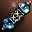
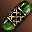

# Предметы

## Лавка Престижных Товаров

- Лавка Престижных Товаров в Гиране теперь будет торговать за адену.
- Установлены следующие цены на оружие и добавлено оружие ранга А в Лавку Престижных Товаров

| Ранг B | Цена | Ранг A | Цена |
| --- | --- | --- | --- |
| Большой Меч , Тяжелый Топор Войны , Посох Духа , Кешанберк , Меч Вальхаллы , Крис , Нож Ада , Коготь Артро , Длинный Лук Темных Эльфов , Двуручный Топор , Рассеиватель Заклинания , Молот Ледяной Бури , Боевая Рапира , Безымянная Победа , Миротворец |  6,680,500 аден | Душегуб , Легендарный Меч , Темный Легион , Протыкатель , Убийца Драконов , Гробовщик , Пронзатель Душ , Жнец , Пылающий Череп Дракона , Элизиум , Крушитель Рока , Ветвь Древа Жизни , Глефа Таллума , Погибель Дракона |  20,741,000 аден |

- Установлены следующие цены на броню и добавлена броня ранга А в Лавку Престижных Товаров

| Ранг В Название |  Цена | Название Ранг А |  Цена |
| --- | --- | --- | --- |
|  |  |  |  |
| Кираса Зубея |  1,596,000 аден | Кираса Кристалла Тьмы |  3,562,000 аден |
| Набедренники Зубея |  997,700 аден | Набедренники Кристалла Тьмы |  2,226,000 аден |
| Кожаная Рубаха Зубея |  1,197,000 аден | Кожаный Доспех Кристалла Тьмы |  2,671,000 аден |
| Кожаные Набедренники Зубея |  748,300 аден | Поножи Кристалла Тьмы |  1,670,000 аден |
| Туника Зубея |  1,197,000 аден | Мантия Кристалла Тьмы |  4,341,000 аден |
| Штаны Зубея |  748,300 аден | Шлем Кристалла Тьмы |  1,336,000 аден |
| Шлем Зубея |  598,600 аден | Запечатанные Перчатки Кристалла Тьмы |  890,000 аден |
| Запечатанные Рукавицы Зубея |  399,100 аден | Запечатанные Сапоги Кристалла Тьмы |  890,000 аден |
| Запечатанные Сапоги Зубея |  399,100 аден | Щит Кристалла Тьмы |  935,000 аден |
| Щит Зубея |  419,000 аден | Латный Доспех Таллума |  5,788,000 аден |
| Кираса Авадона |  1,596,000 аден | Кожаный Доспех Таллума |  4,341,000 аден |
| Набедренники Авадона |  997,700 аден | Туника Таллума |  2,671,000 аден |
| Кожаный Доспех Авадона |  1,946,000 аден | Штаны Таллума |  1,670,000 аден |
| Мантия Авадона |  1,946,000 аден | Шлем Таллума |  1,336,000 аден |
| Диадема Авадона |  598,600 аден | Запечатанные Перчатки Таллума |  890,000 аден |
| Запечатанные Перчатки Авадона |  399,100 аден | Запечатанные Сапоги Таллума |  890,000 аден |
| Запечатанные Сапоги Авадона |  399,100 аден |
| Щит Авадона |  419,000 аден |

## Изменения у НПЦ торговцев

- Торговцы-бакалейщики, теперь продают одинаковые товары
- В магазины добавлены стрелы и арбалетные болты рангов B и A.
- Рецепты сложных ресурсов и Зарядов Души/ Духа были добавлены в продажу у новых НПЦ

| Имя НПЦ | Локация | Имя НПЦ | Локация |
| --- | --- | --- | --- |
| Лиан | Глудин | Тахо | Глудио |
| Дэзиан | Дион | Флени | Гиран |
| Спарки | Хейн | Дроин | Орен |
| Дольфрейн | Аден | Денвер | Годдард |
| Праус | Шутгарт | Эдингер | Руна |
| Метар | Деревня Охотников |  |  |

Рецепты ресурсов:

::spantable::
| Уровень рецепта | Название | Базовая цена |
| --- | --- | --- |
| 1 уровень @span=1:1 | Рецепт - Кожа |  416 аден |
| | Рецепт - Плетеный Лен |  748 аден |
| | Рецепт - Кокс |  748 аден |
| | Рецепт - Сталь |  748 аден |
| | Рецепт - Грубый Костный Порошок |  748 аден |
| 2 уровень @span=1:1 | Рецепт - Веревка |  1,100 аден |
| | Рецепт - Стальная Заготовка |  1,100 аден |
| | Рецепт - Качественная Замша |  1,100 аден |
| | Рецепт - Серебряная Заготовка |  1,100 аден |
| | Рецепт - Очищенный Лак |  1,100 аден |
| | Рецепт - Синтетический Кокс |  1,100 аден |
| | Рецепт - Прочный Шнурок |  1,100 аден |
| 4 уровень @span=1:1 | Рецепт - Орихарукон |  3,080 аден |
| | Рецепт - Мифриловый Сплав |  3,080 аден |
| | Рецепт - Заготовка Ремесленника |  3,080 аден |
| | Рецепт - Заготовка Кузнеца |  3,080 аден |
| | Рецепт - Выделанная Кожа |  3,080 аден |
| | Рецепт - Металлическое Волокно |  3,080 аден |
| | Рецепт - Отвердитель Металла (100%) |  3,080 аден |
| | Рецепт - Металлическая Нить (100%) |  3,080 аден |
| | Рецепт - Прочный Лист Стали (100%) |  3,080 аден |
| 5 уровень | Рецепт - Заготовка Реорина (100%) |  5,280 аден |
| 6 уровень @span=1:1 | Рецепт - Тиски Мастера (100%) |  4,950 аден |
| | Рецепт - Замок Мастера (100%) |  4,950 аден |
| | Рецепт - Заготовка Работника (100%) |  4,950 аден |
| | Рецепт - Заготовка Мастера (100%) |  4,950 аден |
| | Рецепт - Заготовка Оружейника (100%) |  8,470 аден |
| | Рецепт - Наковальня Кузнеца (100%) |  11,660 аден |
| | Рецепт - Тиски Кузнеца (100%) |  19,470 аден |
::end-spantable::

Рецепты Зарядов Души / Духа

::spantable::
| Уровень рецепта | Название | Базовая цена |
| --- | --- | --- |
| 2 уровень @span=1:1 | Рецепт - Заряд Души: Ранг D |  5,500 аден |
| | Рецепт - Заряд Духа: Ранг D |  5,500 аден |
| | Рецепт - Благословенный Заряд Духа: Ранг D |  5,500 аден |
| | Рецепт - Компактная Упаковка: Заряды Души Ранг D (100%) |  5,500 аден |
| | Рецепт - Компактная Упаковка: Заряды Духа Ранг D (100%) |  |
| | Рецепт - Компактная Упаковка: Благословенные Заряды Духа Ранг D (100%) |  5,500 аден |
| | Рецепт - Суперкомпактная Упаковка: Заряды Души Ранг D (100%) |  5,500 аден |
| | Рецепт - Суперкомпактная Упаковка: Заряды Духа Ранг D (100%) |  5,500 аден |
| | Рецепт - Суперкомпактная Упаковка: Благословенные Заряды Духа Ранг D (100%) |  5,500 аден |
| 4 уровень @span=1:1 | Рецепт - Заряд Души: Ранг C |  66,000 аден |
| | Рецепт - Заряд Духа: Ранг C |  66,000 аден |
| | Рецепт - Благословенный Заряд Духа: Ранг C |  66,000 аден |
| | Рецепт - Компактная Упаковка: Заряды Души Ранг C (100%) |  66,000 аден |
| | Рецепт - Компактная Упаковка: Заряды Духа Ранг C (100%) |  66,000 аден |
| | Рецепт - Компактная Упаковка: Благословенные Заряды Духа Ранг D (100%) |  66,000 аден |
| | Рецепт - Суперкомпактная Упаковка: Заряды Души Ранг C (100%) |  66,000 аден |
| | Рецепт - Суперкомпактная Упаковка: Заряды Духа Ранг C (100%) |  66,000 аден |
| | Рецепт - Суперкомпактная Упаковка: Благословенные Заряды Духа Ранг C (100%) |  66,000 аден |
| 6 уровень @span=1:1 | Рецепт - Заряд Души: Ранг B |  110,000 аден |
| | Рецепт - Заряд Духа: Ранг B |  110,000 аден |
| | Рецепт - Благословенный Заряд Духа: Ранг B |  110,000 аден |
| | Рецепт - Компактная Упаковка: Заряды Души Ранг B (100%) |  110,000 аден |
| | Рецепт - Компактная Упаковка: Заряды Духа Ранг B (100%) |  110,000 аден |
| | Рецепт - Компактная Упаковка: Благословенные Заряды Духа Ранг B (100%) |  110,000 аден |
| | Рецепт - Суперкомпактная Упаковка: Заряды Души Ранг B (100%) |  110,000 аден |
| | Рецепт - Суперкомпактная Упаковка: Заряды Духа Ранг B (100%) |  110,000 аден |
| | Рецепт - Суперкомпактная Упаковка: Благословенные Заряды Духа Ранг B (100%) |  110,000 аден |
| 7 уровень @span=1:1 | Рецепт - Заряд Души: Ранг A |  165,000 аден |
| | Рецепт - Заряд Духа: Ранг A |  165,000 аден |
| | Рецепт - Благословенный Заряд Духа: Ранг A |  165,000 аден |
| | Рецепт - Компактная Упаковка: Заряды Души Ранг A (100%) |  165,000 аден |
| | Рецепт - Компактная Упаковка: Заряды Духа Ранг A (100%) |  165,000 аден |
| | Рецепт - Компактная Упаковка: Благословенные Заряды Духа Ранг D (100%) |  165,000 аден |
| | Рецепт - Суперкомпактная Упаковка: Заряды Души Ранг A (100%) |  165,000 аден |
| | Рецепт - Суперкомпактная Упаковка: Заряды Духа Ранг A (100%) |  165,000 аден |
| | Рецепт - Суперкомпактная Упаковка: Благословенные Заряды Духа Ранг A (100%) |  165,000 аден |
::end-spantable::

- Контрабандист Маммона теперь продает Древнюю Адену

**Где купить**: В любом нас. пункте где есть Контрабандист Маммона  
**Когда можно покупать**: с 20.00 до 24.00 ежедневно   
**Условия для покупки**: Персонаж должен быть 61 уровня и выше   
- Древнюю Адену можно приобрести за Адену по курсу 1 к 4   
- Максимальное количество Древней Адены, которое можно приобрести за 1 день -  500,000 Древних Аден 

## Другие изменения в предметах

- Изменены эффекты комплектов S84, PvP комплекты получают такие же усиления:
    - Тяжелый Элитный Доспех Венеры - добавлены эффекты: Точность +4, Скорость +5, сопротивляемость магии (Маг. Защ.) +1%
    - Легкий Элитный Доспех Венеры - добавлены эффекты: Уклонение +7, Сила Крит. Удара + 172, сопротивление параличу + 50%
    - Магический Элитный Доспех Венеры - добавлены эффекты: Скорость +7, уменьшение потребления MP магическими умения на 3%
    - Комплект Тяжелых Доспехов Верпеса - добавлены эффекты: Точность +4, Скорость +7
    - Комплект Легких Доспехов Верпеса - добавлены эффекты: Сила Крит. Удара + 182, Макс. МР + 360
    - Комплект Магических Доспехов Верпеса - добавлены эффекты: Скорость +7, Макс. МР + 92
    - Комплект Магических Доспехов Элегии - добавлены эффекты: Скорость +7, Макс. МР + 97, уменьшение потребления MP магическими умения на 3%
- Комплект Легких Доспехов Верпеса - сопротивляемость параличу заменена на сопротивляемость оглушению.
- Для копий S84 специальная возможность Ускорение усилена с 9 до 11%
- Для брони Верпеса исправлены проблемы с отображением.
- Проблема с отображением наплечника Туники Дестино на мужчинах людях мистиках исправлена.
- Расчленитель Венеры - исправлено описание редкого предмета с понижения потребления MP на увеличение восстановления MP
- Исправлено описание оружия с СА Фокусировка - Когти Окто , Нефритовые Кулаки .
- Исправлено описание предметов - Кровотворец и Меч Архангела .
- Исправлен список товаров продавца Холли в Адене , добавлены товары:

|  | Предмет | Описание |
| --- | --- | --- |
|  |  **Благословенный Заряд Духа: Ранг C**   (Blessed Spiritshot (C-Grade)) | Капсула, в которой заключена сила древнего духа. Значительно увеличивает Маг. Атк. Используется с оружием Ранга C. |
|  |  **Благословенный Заряд Духа: Ранг D**   (Blessed Spiritshot (D-Grade)) | Капсула, в которой заключена сила древнего духа. Значительно увеличивает Маг. Атк. Используется с оружием Ранга D. |
|  |  **Заряд Души: Ранг C**   (Soulshot (C-Grade)) | Капсула, в которой заключена сила древнего духа. Придает оружию дополнительную силу. Используется с оружием Ранга C. |
|  |  **Заряд Души: Ранг D**   (Soulshot (D-Grade)) | Капсула, в которой заключена сила древнего духа. Придает оружию дополнительную силу. Используется с оружием Ранга D. |
|  |  **Самоцвет: Ранг B**   (Gemstone B) |  |
|  |  **Самоцвет: Ранг C**   (Gemstone C) |  |

-  Ожерелье Хранителя Глудио: Вода в описание предмета добавлена фраза о защите от Воды.
- Описание предметов, уменьшающих поглощение MP изменено соответственно их эффекту.
- В описание предметов  Перчатки Венеры и  Красивые Перчатки Венеры в описание предметов добавлена защита от оглушения.
- Эффект предмета  Ивент - Парное Молоко больше не заменяется положительными эффектами слуг и питомцев.
- Исправлена проблема с отсутствием анимации умений для расы Камаэль при ношении Брони Венеры.
- Торговец Маммона теперь не продает Кристаллы A и S ранга.
- Для людей женщин мистиков исправлена проблема с отображением перчаток когда в руках мили оружие +7.
- Исправлена проблема когда при добавлении PvP бонуса оружию Венеры в названии не отображалось название СА.
- Поправлены описания некоторых предметов.
- Исправлена проблема с отсутствием звука при использовании Зарядов Души и при критическом ударе.
- Исправлено описание ожерелий питомцев-витаминов
- Парные Мечи Очарования и Парные Мечи Неиссякаемой Сущности исправлена проблема с улучшением.
- Исправлена иконка для хеллоуинской тыквы.
- Клинок Сирры - исправлена иконка экипированного оружия.
- Исправлена ошибка с редким предметами Венеры, при добавлении PvP бонуса
- Сакредюмор исправлена проблема с анимацией применения Зарядов Духа и Души.
- Исправлена проблема конверсии оружия Оскал Венеры и Страж Венеры .
