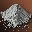

# Хотфиксы

Это хотфиксы установленные в Корее между **High Five, часть 1** и High Five, часть 2 .

## 14.07.2010

- Предметы:
    - Комплект Легкой Брони Кристалла Тьмы - исправлено описание комплекта
- Умения:
    -  **Опыт Коллекционера** - исправлено описание, чтобы соответствовало действию умения
    -  **Божественная Защита** - исправлено описание улучшения умения на Время
    -  **Смертельный Выстрел** - исправлена мощность умения в описании
    - **Напев Стихий** - исправлена ошибка с потребляемым MP
    - **Цепь Исцеления** - 스킬을 적대적인 PC/NPC에게 사용할 수 없도록 변경하였습니다. (возможность/невозможность действия на враждебных пс и нпс)
    -  **Кража Божественности** - добавлена зависимость похождения от разницы в уровнях персонажей
    -  **Безумие** - время повторного применения изменено с 10 мин. до 5 мин. (данное изменение уже добавлено в патчнот выше)
- Квесты:
    - Семь Печатей, Безмолвие Монастыря - исправлена проблема с продолжением квеста при выходе / обрыве связи
    - Исправлено ошибочное появление сообщения о перевесе / забитом инвентаре при разговоре с некоторыми НПЦ
    - Исправлена невозможность получить один из промежуточных квестов Семи Печатей
    - Исправлена проблема появления НПЦ в одном из квестов Семи Печатей
- Зоны Охоты:
    - Кровавый Стражник исправлена какая-то проблема с монстром.
    - Семя Уничтожения непонятные изменения с питомцами или слугами
    - В Зале Бездны 66 уровня исправлено исчезновение миньонов
    - Логово Антараса - усилены РБ
        - Увеличено количество миньонов
        - Увеличено расстояние агра
- Великая Олимпиада:
    - Команда для просмотра статистики цели работает только, если цели видно
    - Для Жезла Вечности оставлен только атрибут Святость 250
    - Исправлена ошибка в одном из олимпийских квестов
- Собирательство
    - Исправлена проблема с невозможностью собрать энергию земли, воздуха, тьмы и святости

## 21.07.2010

- Предметы:
    - В список товаров всех торговцев за исключением торговцев Долине Драконов добавлены  Негасимый Порох и .jpg) Эликсир Ментальной Силы (Ранг D)
- Умения:
    - **Смертельное Жало** и **Веер Стрел** исправлена проблема с невидимостью стрел
    -  **Смертельный Выстрел** - исправлена мощность умения в описании
- Квесты:
    - Путь Лорда - Годдард - исправлена проблема при прохождении
    - Захват Зала Страданий - исправлена проблема с медленным прохождением квеста
    - Один из квестов Семи Печатей - исправлено появление временного босса
    - Во имя легенды - добавлено описание РБ в диалог со стартовым НПЦ
- Зоны Охоты:
    - Логово Антараса - исправлены новые монстры:
        - Исправлена проблема с тем, что они не всегда атакуют противников
        - Исправлено действие яда
        - Увеличена скорость передвижения
- Благословение Невитта:
    - Исправлена проблема действия благословения во время перезапуска и профилактики серверов.

## 28.07.2010

- Умения:
    -  **Смертоносный Удар** и  **Смертельный Выстрел** исправлены проблемы с улучшением умений
    - Исправлены проблемы Камаэль с использованием новых умений с арбалетами
- Зоны Охоты:
    - Лес Неупокоенных - исправлено погружение ног монстров в землю
    - Кузница Богов - исправлено ненормальное поведение некоторых монстров
- Предметы:
    - Исправлено проблема с тултипом +6 PvP комплектов Дестино и Верпеса
    - Резак Венеры исправлено описание СА Ускорение в соответствии с действительность с 9 до 11%
    - Исправлена проблема с иконками брони Венеры и Верпеса
    - Исправлена иконка для ПвП брони Верпеса
- Квесты:
    - Семь Печатей, Цепь Подозрительных Происшествий изменено местоположение НПЦ **Неизвестный труп**
    - Исправлена работа предмета  Сейф Клятвы
    - Окружи заботой исправлена видимость строчки с квестом у стартового НПЦ
- Клан:
    - 아지트 관리인의 외부인 추방 기능을 이용하면 혈맹원이 추방되는 문제를 수정하였습니다.
    - Исправлена какая-то проблема с персонажами, кланами и альянсами использующими большие буквы в названиях
    - 중계탑을 이용하여 관전을 하면 캐릭터의 위치가 지형 아래로 이동하는 문제를 수정하였습니다
- Прочее:
    - Скорость передвижения Подозрительного Торговца уменьшена
    - Исправлено действие бонуса рекомендаций после профилактик.
