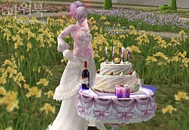
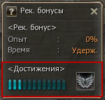
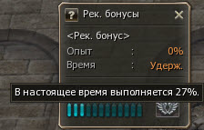
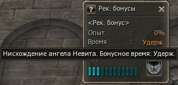

# Игровой процесс

## День Рождения персонажа

- Название системы и праздника было изменено с "День Создания" на "День Рождения"
- В День Рождения персонаж будет получать по почте специальную упаковку с подарками:
    - День Рожденная шляпа в виде торта
    - Праздничный энергетик - дает эффект на 12 часов увеличивающий энергию во время охоты на монстров. Не прекращается, если персонаж погибнет, но эффект напитка пропадет если сменить подкласс.
    - Праздничный пирог - Призывает праздничный торт, который накладывает на группу положительный эффект восстанавливающий энергию 5 минут, Время до повторного использования - 20 минут.
- Изменены функции НПЦ Аллегрия
    - Ранее она выдавала подарки на ДР персонажа, теперь она будет обменивать старую шляпу на новую.
- Теперь будет очень сложно упустить подарок на ДР, он будет 14 дней ждать в почте персонажа и только на 15 день будет удален.
- Удалено системное сообщение о 5-ти летнем юбилее
- На кораблях и воздушных кораблях вызвать праздничный торт будет невозможно

## Благословение Невитта

Система Благословения Невитта дополнена - Нисхождением Невитта

- Добавлен специальный параметр - счетчик, как только он заполнится Вашему персонажу явится душа Невитта
    - Пополняется во время охоты на монстров и другими способами.
    - При наполнении до 100% персонаж получает специальный положительный эффект на 3 минуты

  

- Счетчик расположения Невитта пополняется:
    - При охоте на монстров во время действия специального 4-х часового таймера (дает дополнительные очки), который включается при убийстве первого монстра, и сбрасывается каждый день в 6.30 утра, во время действия этого счетчика начисляются дополнительные очки расположения Невитта.
    - При охоте на монстров, без учета действия таймера.
    - При получении уровня.
    - При падении уровня энергии.
- Действие Нисхождения Невитта:
    - Наполнение Энергий: Уровень энергии персонажа становится максимальным, не смотря на указываемый уровень Энергии.
    - Поддержание энергии: Уровень энергии не падает
    - Отмена штрафа смерти: Если персонаж умрет во время действия Нисхождения Невитта, он не потеряет опыт.
- Внимание!:
    - Прибытие Невитта действует одинакового на мирных и на хаотических персонажей (PK) (сохраняется штраф на выпадение предметов при смерти PK со счетчиком 6 и более)
    - Смерть персонажа не обнуляет счетчик Прибытия Невитта
    - После получения Нисхождения Невитта счетчик расположения сбрасывается, но даже во время действия Нисхождения Невитта персонаж начинает снова наполнять счетчик расположения Невитта
    - Все предметы для восполнения или поддержания энергии не действуют во время действия Нисхождения Невитта
    - Независимо от того, что отображается в уровне Энергии персонажа, во время действия Нисхождения Невитта это 4 уровень.
    - Счетчик Нисхождения Невитта един для основного класса и для подклассов
    - Счетчик не пополняется за убийство монстров меньше персонажа на 9+ уровней, или убийство монстров в мирной зоне.
