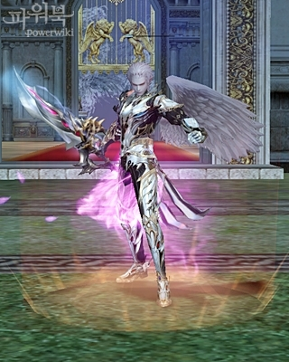
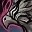
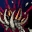
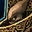
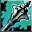

# Классы

## Новые умения

| Название | Классы | Уровень    получения | Описание |
| --- | --- | --- | --- |
|  **Рев Душ** | Берсерк | 62 | Мгновенно восстанавливает 15% от Макс. HP/CP, также увеличивает Макс. HP/CP на 15%. Время действия: 10 мин. |

## Изменения в существующих умениях

| Название | Описание |
| --- | --- |
|  **Нежданная Удача** | Теперь умение можно использовать с мечом. |
|  **Дух Волка** | Длительность 5 мин., потребляет 19 MP |
|  **Дух Медведя** | Длительность 5 мин., потребляет 25 MP |
|  **Дух Пумы** | Длительность 5 мин., потребляет 35 MP |
|  **Дух Огра** | Длительность 5 мин., потребляет 41 MP |
|  **Дух Кролика** | Длительность 5 мин., потребляет 58 MP |
|  **Дух Ястреба** | Длительность 5 мин., потребляет 68 MP |
|  **Песня Штормового Ветра** | Уменьшена защита от арбалета с 15% до 10%. |
|  **Танец Шторма Клинков** | Уменьшена защита от арбалета с 45% до 25%. |
|  **Гармония Благородных** | Защита от арбалетов уменьшена с 10% до 6% |
|  **Симфония Благородных** | Защита от арбалетов уменьшена с 10% до 6% |
|  **Преграда Душ** | Защита от арбалетов уменьшена с 10% до 6% |
|  **Якорь** | Увеличен шанс прохождения умения, уменьшено время прочтения. Время действия снижено до 5 и 5 сек. соответственно эффекту работы умения. Время до повторного прочтения 60 секунд. |
|  **Проклятие: Мрак** | Увеличен шанс прохождения умения, добавлено снижение защиты от всех 6ти атрибутов, влияние на Маг. Защ. снижено до уменьшения на 15%. |
|  **Массовый Страх** | Увеличен шанс прохождения умения, сильно уменьшено время применения умения, длительность умения - 5 сек., время до повторного применения - 75 сек. |
|  **Массовый Мрак** | Увеличен шанс прохождения умения, добавлено снижение защиты от всех 6ти атрибутов, влияние на Маг. Защ. снижено до уменьшения на 15%. |
|  **Разделение Способностей** | Добавлены эффекты, 10% Скор. Атк., 3% Скор. Маг., 20% Шанса Крит. Удара хозяина передаются слуге. |
|  **Взрыв Трупа** | Умению добавлен атрибут - Тьма |

## Другие изменения в умениях

- Умения  **Призвать Воскрешенного**,  **Призвать Порочного** и  **Призвать Проклятого** больше не требуют трупов для призыва слуг, но время призыва сильно увеличено.
- Некромант, Пожиратель Душ, Колдун, Чернокнижник, Последователь Стихий, Мастер Стихий, Последователь Тьмы, Владыка Теней - теперь корректно разделяют атрибуты атаки и защиты для слуг.
-  **Опыт Коллекционера** и  **Удача Коллекционера** - изменены иконки.
- Исправлена проблема с необходимость открывать окно умений, чтобы откат сработал правильно.
