# Предметы

## Чудесный Кубик

- Цена обмена Свитков Модификации снижена вдвое
- Для облегчения идентификации изменены иконки кусков и частей
- Для облегчения идентификации изменены название кусков и частей. Например,Синяя Часть Кубика переименована в Часть Кубика - Оружие D
- В список возможного обмена добавлены Благословенные Свитки Модификации.

| Часть Кубика | Свиток модификации | Стоимость в адене |
| --- | --- | --- |
| Фрагмент Кубика Доспехов – D | 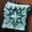 **Свиток: Модифицировать Доспех (D)** |  9,000 аден |
| Фрагмент Кубика Оружия – D | 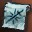 **Свиток: Модифицировать Оружие (D)** |  75,000 аден |
| Сверкающий Фрагмент Кубика Доспехов - D | 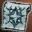 **Благословенный Свиток: Модифицировать Доспех (D)** |  150,000 аден |
| Сверкающий Фрагмент Кубика Оружия – D | 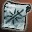 **Благословенный Свиток: Модифицировать Оружие (D)** |  1,350,000 аден |
| Фрагмент Кубика Доспехов – С |  **Свиток: Модифицировать Доспех (С)** |  22,500 аден |
| Фрагмент Кубика Оружия – С | 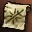 **Свиток: Модифицировать Оружие (С)** |  165,000 аден |
| Сверкающий Фрагмент Кубика Доспехов – С | 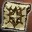 **Благословенный Свиток: Модифицировать Доспех (C)** |  525,000 аден |
| Сверкающий Фрагмент Кубика Оружия – С | 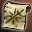 **Благословенный Свиток: Модифицировать Оружие (C)** |  4,500,000 аден |
| Фрагмент Кубика Доспехов – B |  **Свиток: Модифицировать Доспех (B)** |  120,000 аден |
| Фрагмент Кубика Оружия – B | 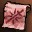 **Свиток: Модифицировать Оружие (B)** |  750,000 аден |
| Сверкающий Фрагмент Кубика Доспехов – Доспех B | 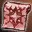 **Благословенный Свиток: Модифицировать Доспех (B)** |  1,125,000 аден |
| Сверкающий Фрагмент Кубика Оружия – B | 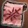 **Благословенный Свиток: Модифицировать Оружие (B)** |  10,500,000 аден |
| Фрагмент Кубика Доспехов – А | 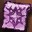 **Свиток: Модифицировать Доспех (А)** |  360,000 аден |
| Фрагмент Кубика Оружия – А | 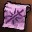 **Свиток: Модифицировать Оружие (А)** |  2,700,000 аден |
| Сверкающий Фрагмент Кубика Доспехов – А | 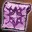 **Благословенный Свиток: Модифицировать Доспех (A)** |  2,700,000 аден |
| Сверкающий Фрагмент Кубика Оружия – А | 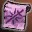 **Благословенный Свиток: Модифицировать Оружие (A)** |  22,500,000 аден |
| Фрагмент Кубика Доспехов – S | 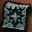 **Свиток: Модифицировать Доспех (S)** |  750,000 аден |
| Фрагмент Кубика Оружия – S | 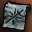 **Свиток: Модифицировать Оружие (S)** |  7,500,000 аден |
| Сверкающий Фрагмент Кубика Доспехов – S | 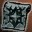 **Благословенный Свиток: Модифицировать Доспех (S)** |  6,750,000 аден |
| Сверкающий Фрагмент Кубика Оружия – S | 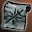 **Благословенный Свиток: Модифицировать Оружие (S)** |  45,000,000 аден |

- Также в список для обмена добавлены особые одноразовые кубики - Прозрачный Кубик - одноразовый и Чудесный Кубик - одноразовый, их можно обменять на ненужные куски и части кубика

| Название | Цена (на выбор) |
| --- | --- |
| Очищенный Кубик - одноразовый | Фрагмент Кубика Оружия – D - 30    Фрагмент Кубика Доспехов – D - 100    Фрагмент Кубика Оружия – С - 15    Фрагмент Кубика Доспехов – С - 50 |
| Чудесный Кубик - одноразовый | Фрагмент Кубика Оружия – D - 10    Фрагмент Кубика Доспехов – D - 30 |

- Сброс таймера использования Чудесного Кубика в 6:30

- При использовании предмета -  **Прозрачный Кубик - одноразовый** можно получить Камни Жизни различных уровней и рангов
- При использовании предмета - 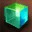 **Чудесный Кубик - одноразовый** - можно получить обычные и сверкающие куски кубика, еще один одноразовый кубик или с очень небольшим шансом уникальный предмет стоимостью  100,000,000 аден

## Другие изменения предметов

-  **Когти Окто** и 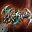 **Нефритовые Кулаки** исправлена проблема с PvP-бонусом
- Камни Жизни 85/86 - исправлена проблема с ненормально низкой ценой при продаже НПЦ.
