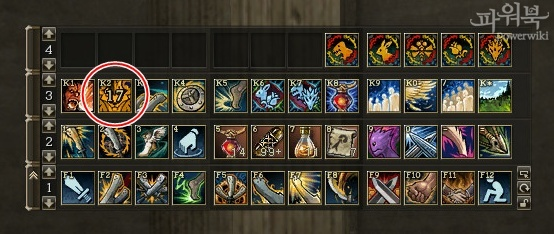
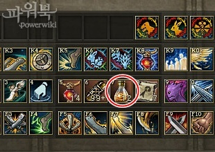
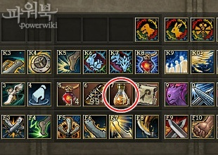
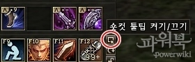
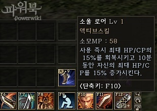
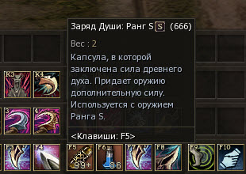
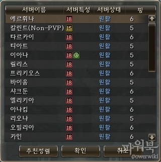
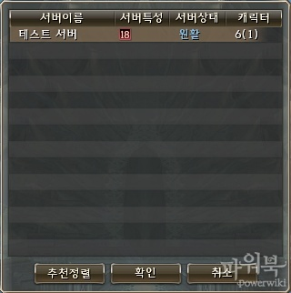

# Прочие изменения

## Панель быстрого доступа

- Добавлено отображение времени, оставшегося до повторного применения, если осталось меньше 20 секунд   
- Добавлено отображение количества предметов в инвентаре, если их меньше 99, если предметов больше 99, то на иконке будет "99+"    
- Добавлена включаемая возможность всплывающих подсказок с описанием умения       
- Добавлено отображение назначенных клавиш на панели быстрого доступа.

## Другие изменения

- В окно выбора сервера добавлено количество Ваших персонажей на сервере
    - Количество удаляемых персонажей отображается в скобках    
- Исправлена проблема, когда зрители осад через Кристалл Передатчик казались отравленными.
- Испытание умения - исправлена проблема с изготовлением квестовых предметов
