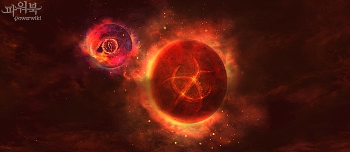
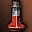

# Игровой процесс
## Окружающий мир

- Иногда ночью небо будет кроваво-красным и на нем будет появляться черная луна.

## Великая Олимпиада

- Изменено количество боев, которые персонаж может провести в неделю.
    - Индивидуальные соревнование вне классов - 60 боев (вместо 30)
    - Групповые соревнования - 10 боев (вместо 30)
- Изменено минимальное количество записавшихся, необходимое для начала боев:
    - Групповые соревнования - 6 команд (вместо 5)
- Теперь победители в Групповых поединках (без ограничений по классам) получают все 100% забираемых у проигравших очков. (Удалены дополнительные очки)
- Изменено оружие  **Копье Вечности**:
    - Уменьшено количество снимаемых положительных эффектов
    - Повышен шанс отразить умение обратно противнику
- .jpg) **Книга Древних - Божественное Вдохновение (Оригинал)** изменено:
    - Теперь предмет можно обменять, выбросить или продать
    - Стоимость у Старшего Управляющего Олимпиадой снижена с  **Символ Олимпиады** до  **Символ Олимпиады**
-  **Эликсир Караванщика** больше нельзя использовать на Великой Олимпиаде

## Слуги и Питомцы

- Слуга Кай - исправлена иконка и описание для умения **Щит Повреждения**
- Ездовой Дракон Хранителя - исправлена иконка и описание умения **Рывок Ездового Дракона**
- Исправлена проблема с кормлением питомцев при 0 значении сытости.

## Прочите изменения в игровом процессе

- Только для персонажей 80+ доступны телепорты через Separate Spirits
- Действие Прибытия Невитта во время осад исправлено
- 루운성 공성전에 출현하는 트리올의 수장 베놈 이 옥좌에서 일정 거리이상 떨어지면 다시 옥좌로 이동하도록 변경되었다. (что-то о Беноме)
