# Классы
## Изменение уровня изучения умений

- Из-за изменения уровня изучения  **Песня Отражения**,  **Напев Защиты**, изученное умение отменится, SP за их изучение возвращается персонажу, умение необходимо изучить заново.
- Для следующих умений изменен уровень изучения:

::spantable::
| Класс | Умение | Уровень изучения    до обновления | Уровень изучения    после обновления |
| --- | --- | --- | --- |
| Проповедник |  **Благословение Тела** (6 ур.) | 72 | 70 |
| Менестрель @span=1:4 |  **Песня Охотника** | 49 | 40 |
| | **Песня Отражения** | 40 | 43 |
| | **Песня Святости** | 43 | 49 |
| | **Шепот Битвы** | 60 | 46 / 52 / 60 |
| Епископ    Мудрец Евы    Мудрец Шилен |  **Инквизитор** | 44 | 40 |
| Стрелок    Серебряный Рейнджер    Призрачный Рейнджер |  **Душа Стрелка** | 46 | 40 |
| Берсерк    Арбалетчик    Палач |  **Критическое Чутье** | 43 | 40 |
| Вестник Войны @span=1:2 |  **Напев Защиты**    | 40 | 48 |
| | **Напев Хищника** | 48 | 40 |
| Некромант | 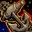 **Якорь** | 44 | 40 |
| Паладин    Мститель    Рыцарь Евы    Рыцарь Шилен |  **Авангард** | 43 | 40 |
::end-spantable::

## Новые умения

| Название | Класс | Уровень | Описание |
| --- | --- | --- | --- |
|  **Прокалывающая Атака** | Апостол | 80 | Пассивное умение. При обычной атаке есть шанс понизить Физ. Защ. противника на 23% |
|  **Жест Защиты** | Танцор Смерти | 60 | Аура. На 2 мин. повышает Физ. Защ. на 25% / Уклонение на 3 / Маг. Защ. на 10%. |
|  **Гнев Паагрио** | Верховный Шаман | 48 / 56 | На 20 минут повышает скорость атаки на 15% / 33% членов группы / клана. |
|  **Напев Берсерка** | Вестник Войны | 44 / 52 | На 20 минут понижает группе Физ. Защ., Маг. Защ, Уклонение, повышает Физ. Атк., Маг. Атк., Скорость Атк., Скор. Маг, Скорость. |
|  **Потенциальная Способность** | Охотник За Наградой | 28 / 40 / 49 | Пассивное умение. Повышает Шанс. Крит. Атк. на 20% / 30% / 40%, Силу Крит. Атк. на 177 / 295 / 384 при использовании кинжала или парных кинжалов. |
|  **Удачный Удар** | Кладоискатель | 83 | Физическое умение. Удар с одновременной оценкой противника. Возможен смертельный или полусмертельный удар. Возможен критический удар. Возможен сверхудар. Мощность 11234. Можно использовать с парными кинжалами. |
|  **Массовое Присвоение** | Собиратель | 28 | Физическое умение. Присваивает результаты оценки из окружающих трупов. |
| 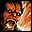 **Боевой Клич** | Кузнец | 40 / 49 / 58 / 64 / 70 | Физическое умение. Мгновенно восстанавливает HP и на 10 мин. повышается Макс. НР. |
|  **Прилив Маны** | Палач | 40 / 49 / 58 / 64 / 68 / 72 | Пассивное умение. Повышает Макс. МР персонажа. Умение можно улучшать. |

## Добавление существующих умений

| Название | Класс | Уровень |
| --- | --- | --- |
| 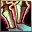 **Владение Кинжалом** | Собиратель | 20 |
|  **Владение Парными Кинжалами** | Кладоискатель | 81 |
|  **Смертельный Выпад** | Охотник За Наградой | 40 |
|  **Удар в Спину** | Охотник За Наградой | 40 |

## Изменение существующих умений

- Умения изучаемые с помощью Забытых Свитков усилены см. ниже.
- Скорректировано последовательное применение нескольких умений
- Ко многим умениям Кладоискателя добавлена возможность использования при экипировке кинжала / парных кинжалов.
- Изменены некоторые магические умения Палачей, для больше эффективности.
- Для умений накладывающих Удержание изменена длительность действия, но уменьшено время до повторного применения.

### Люди

::spantable::
| Класс | Умение | Изменение |
| --- | --- | --- |
| Дуэлист |  **Ярость Звука** | Максимальный уровень зарядки в умении изменен на 8. |
| Полководец |  **Прилив Ужаса** | Добавлено снижение Физ. Защ. и Уклонения противников. Повышен шанс прохождения умения. |
| Паладин    Рыцарь Феникса @span=1:7 |  **Агрессия** | Мощность умения увеличена. |
| | **Аура Ненависти** | Мощность умения увеличена. |
| | **Крепость Щитов** | Потребление МР уменьшено. |
| | **Абсолютная Защита** | Маг. Защ. увеличена. |
| | **Трибунал** | Увеличена мощность и эффекты умения. Добавлен эффект повышения агрессии противника. |
| |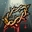 **Ангельский Образ** | Действие умения изменено, чтобы не дублировать другие умения. |
| | **Атака Щитом** | Добавлен эффект повышения агрессии противника. |
| Мститель    Рыцарь Ада @span=1:8 |  **Безумный Сокрушитель** | Увеличен шанс прохождения умения и мощность умения, уменьшено время до повторного использования. |
| | **Крик Ада** | Добавлен эффект уменьшения скорости противника, повышен шанс прохождения умения. |
| | **Агрессия** | Мощность умения увеличена. |
| | **Аура Ненависти** | Мощность умения увеличена. |
| | **Крепость Щитов** | Потребление МР уменьшено. |
| | **Абсолютная Защита** | Маг. Защ. увеличена. |
| | **Правосудие** | Увеличена мощность и эффекты умения. Добавлен эффект повышения агрессии противника. |
| | **Атака Щитом** | Добавлен эффект повышения агрессии противника. |
| Снайпер @span=1:4 |  **Огненный Ястреб** | Добавлен урон Огнем каждый тик в течение 10 секунд. |
| | **Семь Стрел** | Весь урон наносит сразу. Мощность умения увеличена. Время прочтения, потребление MP и время до повторного применения уменьшены. |
| | **Веер Стрел** | Увеличено потребление МР |
| | **Смертельное Жало** | Шанс нанести критический удар понижен. |
| Архимаг @span=1:3 |  **Метеор** | Действие умения изменено, оно наносит мгновенный урон и урон растянутый во времени. Время до повторного применения уменьшено. |
| |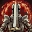 **Броня Пламени** | Защита от Огня от улучшения умения усилена. Время применения уменьшено. |
| | **Щит Стихий** | Защита была уменьшена с 90 до 70% |
| Пожиратель Душ @span=1:4 |  **Массовый Мрак** | Добавлен урон Тьмой. Время до повторного применения уменьшено с 15 до 12 сек. |
| | **Проклятие: Мрак** | Добавлен урон Тьмой. |
| | **Метеор** | Действие умения изменено, оно наносит мгновенный урон и урон растянутый во времени. Время до повторного применения уменьшено. |
| | **Вампирический Туман** | Поглощение НР уменьшено с 40 до 20%, увеличен шанс прохождения умения, уменьшено время действия умения и время до повторного применения. |
| Колдун    Чернокнижник @span=1:2 |  **Разделение Способностей** | Добавлен эффект увеличения Физ. Атк., Скор. Маг. и Шанса Крит. Атк. |
| | Все умения призывающие слуг | Время прочтения заклинания уменьшено с 15 сек. до 6 сек. |
::end-spantable::

### Эльфы

::spantable::
| Класс | Умение | Изменение |
| --- | --- | --- |
| Рыцарь Евы    Храмовник Евы @span=1:6 |  **Агрессия** | Мощность умения увеличена. |
| | **Аура Ненависти** | Мощность умения увеличена. |
| | **Крепость Щитов** | Потребление МР уменьшено. |
| | **Абсолютная Защита** | Маг. Защ. увеличена. |
| | **Трибунал** | Увеличена мощность и эффекты умения. Добавлен эффект повышения агрессии противника. |
| | **Атака Щитом** | Добавлен эффект повышения агрессии противника. |
| Менестрель @span=1:2 |  **Симфония Меча** | Эффект страха заменен на безмолвие. Мощность умения уменьшена, потребление МР повышено. |
| | **Ментальная Симфония** | Увеличена мощность умения и шанс успешного прохождения. Время действия, потребление МР и время применения уменьшены. |
| Страж Лунного Света @span=1:4 |  **Дождь Стрел** | Добавлен урон Ветром каждый тик в течение 10 секунд. |
| | **Семь Стрел** | Весь урон наносит сразу. Мощность умения увеличена. Время прочтения, потребление MP и время до повторного применения уменьшены. |
| | **Веер Стрел** | Увеличено потребление МР |
| | **Смертельное Жало** | Шанс нанести критический удар понижен. |
| Магистр Магии @span=1:3 |  **Падение Звезды** | Действие умения изменено, оно наносит мгновенный урон и урон растянутый во времени. Время до повторного применения уменьшено. |
| | **Броня Мороза** | Защита от Воды от улучшения умения усилена. Время применения уменьшено. |
| | **Щит Стихий** | Защита была уменьшена с 90 до 70% |
| Последователь Стихий   Мастер Стихий @span=1:2 |  **Разделение Способностей** | Добавлен эффект увеличения Физ. Атк., Скор. Маг. и Шанса Крит. Атк. |
| | Все умения призывающие слуг | Время прочтения заклинания уменьшено с 15 сек. до 6 сек. |
::end-spantable::

### Темные Эльфы

::spantable::
| Класс | Умение | Изменение |
| --- | --- | --- |
| Рыцарь Шилен    Храмовник Шилен @span=1:7 |  **Агрессия** | Мощность умения увеличена. |
| | **Аура Ненависти** | Мощность умения увеличена. |
| | **Крепость Щитов** | Потребление МР уменьшено. |
| | **Абсолютная Защита** | Маг. Защ. увеличена. |
| | **Правосудие** | Увеличена мощность и эффекты умения. Добавлен эффект повышения агрессии противника. |
| | **Прикосновение Шилен** | Действие умения изменено, чтобы не дублировать другие умения. |
| | **Атака Щитом** | Добавлен эффект повышения агрессии противника. |
| Танцор Смерти @span=1:2 |  **Танец Медузы** | Время до повторного применения и действие умения уменьшены. Улучшение умения на время - эффект уменьшен. |
| | **Демонический Танец Клинков** | Увеличена мощность умения и шанс успешного прохождения. Время действия, потребление МР и время применения уменьшены. |
| Страж Теней @span=1:4 | 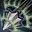 **Призрачное Пробивание** | Добавлен урон Тьмой каждый тик в течение 10 секунд. |
| | **Семь Стрел** | Весь урон наносит сразу. Мощность умения увеличена. Время прочтения, потребление MP и время до повторного применения уменьшены. |
| | **Веер Стрел** | Увеличено потребление МР |
| | **Смертельное Жало** | Шанс нанести критический удар понижен. |
| Повелитель Бури @span=1:3 |  **Падение Звезды** | Действие умения изменено, оно наносит мгновенный урон и урон растянутый во времени. Время до повторного применения уменьшено. |
| | **Броня Урагана** | Защита от Ветра от улучшения умения усилена. Время применения уменьшено. |
| | **Щит Стихий** | Защита была уменьшена с 90 до 70% |
| Последователь Тьмы    Владыка Теней @span=1:3 |  **Разделение Способностей** | Добавлен эффект увеличения Физ. Атк., Скор. Маг. и Шанса Крит. Атк. |
| | Все умения призывающие слуг | Время прочтения заклинания уменьшено с 15 сек. до 6 сек. |
| |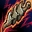 **Шип Смерти** | Мощность умения уменьшена. |
| Жрец Шилен |  **Корни Престола** | Эффект снижения НР повышен с 30 до 90. Добавлен эффект снижения МР. Повышен шанс прохождения умения, уменьшено время действия умения и время до повторного применения. |
::end-spantable::
 

### Орки

::spantable::
| Класс | Умение | Изменение |
| --- | --- | --- |
| Титан |  **Удар Низвержения** | Теперь это умение атакует только одну цель. Мощность умения увеличена. Дистанция умения увеличена с 40 до 150. |
| Аватар @span=1:2 |  **Неистовая Сила** | Заряд можно поднять до 8 уровня. |
| | **Сила Разрушения** | Мощность и шанс прохождения умения увеличены. Время действия умения уменьшено. |
| Верховный Шаман |  **Раскалывание** | Условия использования умения изменены, теперь его можно использовать с любым оружием, кроме Лука / Арбалета. Добавлена возможность улучшения умения. |
| Вестник Войны   Глас Судьбы @span=1:2 |  **Напев Охраны** | Время действия умения увеличено с 600 до 1200 сек (20 мин.) |
| | **Раскалывание** | Условия использования умения изменены, теперь его можно использовать с любым оружием, кроме Лука / Арбалета. Добавлена возможность улучшения умения. |
::end-spantable::

### Гномы

::spantable::
| Класс | Умение | Изменение |
| --- | --- | --- |
| Охотник за Наградой |  **Владение Мечом/Дробящим Оружием** | Добавлено увеличение шанса оглушить противника. |
| Кузнец @span=1:2 |  **Владение Мечом/Дробящим Оружием** | Добавлено увеличение шанса оглушить противника. |
| | **Острое Лезвие**     **Шип**     **Перетяжка**    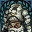 **Закалка**     **Тщательное Дубление**    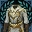 **Вышивка** | Увеличено время действия умения с 600 до 1200 сек (20 мин.). Увеличена дистанция использования с 40 на 400. |
::end-spantable::

### Камаэль

| Класс | Умение | Изменение |
| --- | --- | --- |
| Берсерк |  **Яростная Душа** | Изменено уменьшение Физ. Защ. с 20 на 5%. |
| Палач |  **Удар Душ**     **Вихрь Души**     **Угасание Вихря Души**     **Леопольд**     **Круг Истребления**    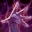 **Скорбящая Душа** | Количество МР необходимое для использования умений уменьшено на 20% |
| 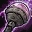 **Мастерское Чтение Заклинаний** | Умению добавлены новые уровни: 2 ур. - Сокращает время до повторного использования магических умений на 15% - изучается на 49 ур. 3 ур. - Сокращает время до повторного использования магических умений на 20% - изучается на 55 ур. |  |
| 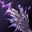 **Темное Пламя** | Эффект страха заменен на снижение скорости противника на 30. Время до повторного применения уменьшено. |  |
|  **Воодушевление Души** | Умению добавлены новые уровни: 3 ур. - Увеличивается Маг. Атк. на 75% - изучается на 64 ур. |  |
|  **Владение Рапирой** | Добавлен эффект + 15% к Скор. Маг. Добавляется на 40 ур. персонажа. |  |
| 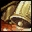 **Быстрое Восстановление** | Умению добавлены новые уровни: 2 ур. - Увеличивается скорость восстановления MP - изучается на 49 ур. |  |
|  **Электрический Шок** | Теперь это магическое умение (дебафф). Эффекты умения изолированы друг от друга, во избежание переналожения: Вторичный эффект - замедление Основной эффект - паралич |  |
|  **Щит Стихий** | Защита была уменьшена с 90 до 70% |  |
| Арбалетчик |  **Дикий Выстрел** | Мощность умения увеличена. |
|  **Главная Цель** | Улучшение на Мощность - прирост уменьшен. |  |
|  **Веер Стрел** | Увеличено потребление МР |  |
|  **Смертельное Жало** | Шанс нанести критический удар понижен. |  |
| Инспектор |  **Тонкая Кожа** | Умению добавлены новые уровни: 7 ур. - изучается на 74 ур. |

## Прочие изменения классов

- 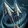 **Сдвоенный Выстрел**, 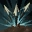 **Восходящий Выстрел** - в описание добавлено влияние душ на умение
-  **Шип Смерти** некорректная информация в улучшении умения была исправлена.
-  **Уход за Доспехами** - исправлено описание
- 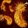 **Образ Пламени** - исправлено описание
-  **Цепь Исцеления** исправлены проблемы в действии умения.
