# Предметы
## Новые аксессуары

- Закен (83 ур.) - добавлен трофей - Серьга Бессмертного Закена
- Серьга Бессмертного Закена является улучшенной версией предмета  **Серьга Закена**
- При одновременном ношении, действовать будет только Серьга Бессмертного Закена

| Предмет | Маг. Защ. | Описание |
| --- | --- | --- |
|  **Серьга Закена** | 71 | Дает следующие эффекты: MP +31, увеличение сопротивления кровотечению на 30%, увеличение шанса вызвать кровотечение цели на 30%, увеличение эффективности лечения, увеличение Ярости Вампира, увеличение сопротивления шоку/аномальному состоянию на 20%, увеличение шанса вызвать шок/аномальное состояние цели на 20%. Если персонаж надевает две таких серьги, то эффект проявится только у одной из них. |
|  **Серьга Бессмертного Закена** | 94 | Дает следующие эффекты: **MP +37**, увеличение сопротивления кровотечению на 30%, увеличение шанса вызвать кровотечение цели на 30%, **увеличение эффективности лечения на 15%**, увеличение Ярости Вампира, **увеличение сопротивления шоку/аномальному состоянию на 30%**, **увеличение шанса вызвать шок/аномальное состояние цели на 30%**, **увеличивает защиту от Тьмы на 15**. Если персонаж надевает две таких серьги, то эффект проявится только у одной из них. |

## Новые плащи

- За убийство некоторых Боссов теперь можно получить плащ
- Плащи получают запечатанными, снять можно у специальных НПЦ в Руне и Адене
- Плащи можно обменять, продать, при экипировке персонаж получает специальное умение

| Плащ | Где получить |
| --- | --- |
| 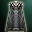 **Запечатанный Плащ Закена** | Трофей за убийство босса Закен (83 ур.) |
| 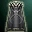 **Запечатанный Плащ Фреи** | Трофей за убийство боссов Фрея (обычная), Фрея (улучшенная) |
|  **Запечатанный Плащ Фринтезы** | Трофей за убийство босса Скарлет Ван Халиша |

| Плащ Закена    Плащ Духа Закена | Плащ Фреи    Плащ Духа Фреи | Плащ Фринтезы    Плащ Духа Фринтезы |
| --- | --- | --- |
| 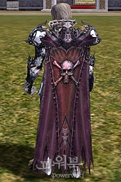 | 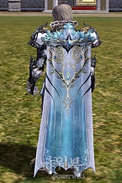 | 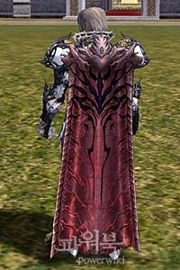 |
| 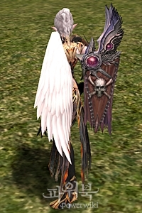 | 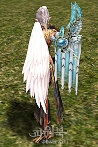 | 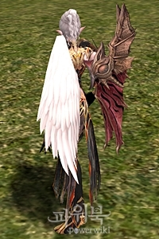 |

- Добавлены новые плащи, которые можно получить по квесту
- Эти плащи невозможно обменять или продать, при экипировке персонаж получает специальное умение

| Плащ | Где получить |
| --- | --- |
|  **Плащ Духа Закена** | Награда за квест Плащ с вышитой душой -1(Закен) (78 ур.) |
|  **Плащ Духа Фреи** | Награда за квест Плащ с вышитой душой -2(Фрея) (82 ур.) |
|  **Плащ Духа Фринтезы** | Награда за квест Плащ с вышитой душой -3(Фринтеза) (80 ур.) |

- Следующие специальные умения доступны при ношении плащей:

| Плащ | Умение | Описание |
| --- | --- | --- |
|  **Плащ Закена** **Плащ Духа Закена** | Зов Закена | Перемещает в окрестности логова Закена. Время до повторного использования 30 мин. |
| 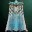 **Плащ Фреи** **Плащ Духа Фреи** | Зов Фреи | Перемещает в окрестности логова Фреи. Время до повторного использования 30 мин. |
|  **Плащ Фринтезы** **Плащ Духа Фринтзы** | Зов Фринтезы | Перемещает в окрестности логова Фринтезы. Время до повторного использования 30 мин. |

## Лавка Престижных Товаров

- Вернули возможность оплаты товаров кристаллами

| Предметы | Цена в адене | Цена в кристаллах |
| --- | --- | --- |
| Ранг В |  |  |
| Большой Меч, Тяжелый Топор Войны, Посох Духа, Кешанберк, Меч Вальхаллы, Крис, Нож Ада, Коготь Артро, Длинный Лук Темных Эльфов, Двуручный Топор, Рассеиватель Заклинания, Молот Ледяной Бури, Боевая Рапира, Безымянная Победа, Миротворец |  6,680,500 аден | 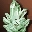 **Кристалл: Ранг C**    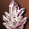 **Кристалл: Ранг B** |
| Ранг А |  |  |
| Душегуб, Легендарный Меч, Темный Легион, Протыкатель, Убийца Драконов, Гробовщик, Пронзатель Душ, Жнец, Пылающий Череп Дракона, Элизиум, Крушитель Рока, Ветвь Древа Жизни, Глефа Таллума, Погибель Дракона |  20,741,000 аден |  **Кристалл: Ранг B**    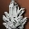 **Кристалл: Ранг A** |

| Название | Цена в адене | Цена в кристаллах |
| --- | --- | --- |
| Ранг В |  |  |
| Кираса Зубея |  1,596,000 аден |  **Кристалл: Ранг C**     **Кристалл: Ранг B** |
| Набедренники Зубея |  997,700 аден |  **Кристалл: Ранг C**     **Кристалл: Ранг B** |
| Кожаная Рубаха Зубея |  1,197,000 аден |  **Кристалл: Ранг C**     **Кристалл: Ранг B** |
| Кожаные Набедренники Зубея |  748,300 аден |  **Кристалл: Ранг C**     **Кристалл: Ранг B** |
| Туника Зубея |  1,197,000 аден |  **Кристалл: Ранг C**     **Кристалл: Ранг B** |
| Штаны Зубея |  748,300 аден |  **Кристалл: Ранг C**     **Кристалл: Ранг B** |
| Шлем Зубея |  598,600 аден |  **Кристалл: Ранг C**     **Кристалл: Ранг B** |
| Запечатанные Рукавицы Зубея |  399,100 аден |  **Кристалл: Ранг C**     **Кристалл: Ранг B** |
| Запечатанные Сапоги Зубея |  399,100 аден |  **Кристалл: Ранг C**     **Кристалл: Ранг B** |
| Щит Зубея |  419,000 аден |  **Кристалл: Ранг C**     **Кристалл: Ранг B** |
| Кираса Авадона |  1,596,000 аден |  **Кристалл: Ранг C**     **Кристалл: Ранг B** |
| Набедренники Авадона |  997,700 аден |  **Кристалл: Ранг C**     **Кристалл: Ранг B** |
| Кожаный Доспех Авадона |  1,946,000 аден |  **Кристалл: Ранг C**     **Кристалл: Ранг B** |
| Мантия Авадона |  1,946,000 аден |  **Кристалл: Ранг C**     **Кристалл: Ранг B** |
| Диадема Авадона |  598,600 аден |  **Кристалл: Ранг C**     **Кристалл: Ранг B** |
| Запечатанные Перчатки Авадона |  399,100 аден |  **Кристалл: Ранг C**     **Кристалл: Ранг B** |
| Запечатанные Сапоги Авадона |  399,100 аден |  **Кристалл: Ранг C**     **Кристалл: Ранг B** |
| Щит Авадона |  419,000 аден |  **Кристалл: Ранг C**     **Кристалл: Ранг B** |
| Ранг А |  |  |
| Кираса Кристалла Тьмы |  3,562,000 аден |  **Кристалл: Ранг B**     **Кристалл: Ранг A** |
| Набедренники Кристалла Тьмы |  2,226,000 аден |  **Кристалл: Ранг B**     **Кристалл: Ранг A** |
| Кожаный Доспех Кристалла Тьмы |  2,671,000 аден |  **Кристалл: Ранг B**     **Кристалл: Ранг A** |
| Поножи Кристалла Тьмы |  1,670,000 аден |  **Кристалл: Ранг B**     **Кристалл: Ранг A** |
| Мантия Кристалла Тьмы |  4,341,000 аден |  **Кристалл: Ранг B**     **Кристалл: Ранг A** |
| Шлем Кристалла Тьмы |  1,336,000 аден |  **Кристалл: Ранг B**     **Кристалл: Ранг A** |
| Запечатанные Перчатки Кристалла Тьмы |  890,000 аден |  **Кристалл: Ранг B**     **Кристалл: Ранг A** |
| Запечатанные Сапоги Кристалла Тьмы |  890,000 аден |  **Кристалл: Ранг B**     **Кристалл: Ранг A** |
| Щит Кристалла Тьмы |  935,000 аден |  **Кристалл: Ранг B**     **Кристалл: Ранг A** |
| Латный Доспех Таллума |  5,788,000 аден |  **Кристалл: Ранг B**     **Кристалл: Ранг A** |
| Кожаный Доспех Таллума |  4,341,000 аден |  **Кристалл: Ранг B**     **Кристалл: Ранг A** |
| Туника Таллума |  2,671,000 аден |  **Кристалл: Ранг B**     **Кристалл: Ранг A** |
| Штаны Таллума |  1,670,000 аден |  **Кристалл: Ранг B**     **Кристалл: Ранг A** |
| Шлем Таллума |  1,336,000 аден |  **Кристалл: Ранг B**     **Кристалл: Ранг A** |
| Запечатанные Перчатки Таллума |  890,000 аден |  **Кристалл: Ранг B**     **Кристалл: Ранг A** |
| Запечатанные Сапоги Таллума |  890,000 аден |  **Кристалл: Ранг B**     **Кристалл: Ранг A** |

- Добавлены аксессуары рангов А и Б в продажу

| Предметы | Цена в адене | Цена в кристаллах |
| --- | --- | --- |
| Ранг В |  |  |
| 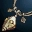 **Адамантитовое Ожерелье** |  621,200 аден |  **Кристалл: Ранг C**     **Кристалл: Ранг B** |
|  **Адамантитовая Серьга** |  465,900 аден |  **Кристалл: Ранг C**     **Кристалл: Ранг B** |
| 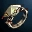 **Адамантитовое Кольцо** |  310,600 аден |  **Кристалл: Ранг C**     **Кристалл: Ранг B** |
|  **Ожерелье Благословения** |  621,200 аден |  **Кристалл: Ранг C**     **Кристалл: Ранг B** |
|  **Серьга Благословения** |  465,900 аден |  **Кристалл: Ранг C**     **Кристалл: Ранг B** |
|  **Кольцо Благословения** |  310,600 аден |  **Кристалл: Ранг C**     **Кристалл: Ранг B** |
| 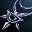 **Черное Ожерелье** |  948,000 аден |  **Кристалл: Ранг C**     **Кристалл: Ранг B** |
|  **Черная Серьга** |  711,000 аден |  **Кристалл: Ранг C**     **Кристалл: Ранг B** |
|  **Черное Кольцо** |  474,000 аден |  **Кристалл: Ранг C**     **Кристалл: Ранг B** |
| Ранг А |  |  |
|  **Запечатанное Ожерелье Феникса** |  1,340,000 аден |  **Кристалл: Ранг B**     **Кристалл: Ранг A** |
|  **Запечатанная Серьга Феникса** |  1,005,000 аден |  **Кристалл: Ранг B**     **Кристалл: Ранг A** |
|  **Запечатанное Кольцо Феникса** |  670,000 аден |  **Кристалл: Ранг B**     **Кристалл: Ранг A** |
|  **Запечатанное Ожерелье Величия** |  1,998,000 аден |  **Кристалл: Ранг B**     **Кристалл: Ранг A** |
| 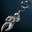 **Запечатанная Серьга Величия** |  1,498,000 аден |  **Кристалл: Ранг B**     **Кристалл: Ранг A** |
|  **Запечатанное Кольцо Величия** |  999,000 аден |  **Кристалл: Ранг B**     **Кристалл: Ранг A** |

## Кузнецы

- Теперь Кузнец Маммона обменивает оружие на равноценное вплоть до лучшего оружия ранга A, за исключением эксклюзивного оружия Камаэль и парных мечей
- Кузнецам в городах добавлена функция снятия печати с предметов ранга А.

::spantable::
| Тип | Предмет | Кузнец Маммона | Кузнец в городе |
| --- | --- | --- | --- |
| Доспехи Величия @span=1:6 |  **Запечатанный Латный Доспех Величия** |  772,500 Древних Аден |  772,500 аден |
| |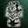 **Запечатанный Кожаный Доспех Величия** |  579,750 Древних Аден |  579,750 аден |
| |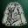 **Запечатанная Мантия Величия** |  579,750 Древних Аден |  579,750 аден |
| | **Запечатанная Диадема Величия** |  198,000 Древних Аден |  198,000 аден |
| |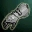 **Запечатанные Рукавицы Величия** |  132,000 Древних Аден |  132,000 аден |
| |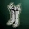 **Запечатанные Сапоги Величия** |  132,000 Древних Аден |  132,000 аден |
| Доспехи кошмаров @span=1:7 | 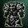 **Запечатанный Доспех Кошмаров** |  772,500 Древних Аден |  772,500 аден |
| |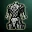 **Запечатанный Кожаный Доспех Кошмаров** |  579,750 Древних Аден |  579,750 аден |
| |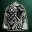 **Запечатанная Мантия Кошмаров** |  579,750 Древних Аден |  579,750 аден |
| | **Запечатанный Шлем Кошмаров** |  198,000 Древних Аден |  198,000 аден |
| | **Запечатанные Рукавицы Кошмаров** |  132,000 Древних Аден |  132,000 аден |
| |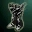 **Запечатанные Сапоги Кошмаров** |  132,000 Древних Аден |  132,000 аден |
| |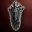 **Запечатанный Щит Кошмаров** |  138,750 Древних Аден |  138,750 аден |
| Доспехи Кристалла Тьмы @span=1:8 | 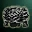 **Запечатанная Кираса Кристалла Тьмы** |  347,250 Древних Аден |  347,250 аден |
| | **Запечатанные Набедренники Кристалла Тьмы** |  216,750 Древних Аден |  216,750 аден |
| | **Запечатанный Кожаный Доспех Кристалла Тьмы** |  260,250 Древних Аден |  260,250 аден |
| |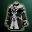 **Запечатанная Мантия Кристалла Тьмы** |  260,250 Древних Аден |  260,250 аден |
| |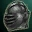 **Запечатанный Шлем Кристалла Тьмы** |  130,500 Древних Аден |  130,500 аден |
| | **Запечатанные Перчатки Кристалла Тьмы** |  87,000 Древних Аден |  87,000 аден |
| |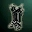 **Запечатанные Сапоги Кристалла Тьмы** |  87,000 Древних Аден |  87,000 аден |
| | **Запечатанный Щит Кристалла Тьмы** |  97,500 Древних Аден |  97,500 аден |
| Доспехи Таллума @span=1:7 | 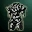 **Запечатанный Латный Доспех Таллума** |  507,750 Древних Аден |  507,750 аден |
| |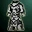 **Запечатанный Кожаный Доспех Таллума** |  381,000 Древних Аден |  381,000 аден |
| | **Запечатанная Туника Таллума** |  260,250 Древних Аден |  260,250 аден |
| |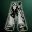 **Запечатанные Штаны Таллума** |  162,750 Древних Аден |  162,750 аден |
| | **Запечатанный Шлем Таллума** |  130,500 Древних Аден |  130,500 аден |
| |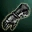 **Запечатанные Перчатки Таллума** |  87,000 Древних Аден |  87,000 аден |
| |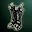 **Запечатанные Сапоги Таллума** |  87,000 Древних Аден |  87,000 аден |
| Аксессуары @span=1:6 |  **Запечатанное Ожерелье Величия** |  853,669 Древних Аден |  853,669 аден |
| | **Запечатанная Серьга Величия** |  640,251 Древних Аден |  640,251 аден |
| | **Запечатанное Кольцо Величия** |  426,834 Древних Аден |  426,834 аден |
| | **Запечатанное Ожерелье Феникса** |  855,525 Древних Аден |  855,525 аден |
| | **Запечатанная Серьга Феникса** |  641,644 Древних Аден |  641,644 аден |
| | **Запечатанное Кольцо Феникса** |  427,763 Древних Аден |  427,763 аден |
::end-spantable::

- Кузнецы в городах могут запечатывать предметы ранга А
- Кузнецам в городах добавлена возможность добавлять Специальные возможности оружию ранга B.

## Прочие изменения предметов

- Для облегчения дифференциации изменены иконки Забытых Свитков
    - Для рыцарей - иконка с щитом
    - Для воителей - иконка со скрещенными мечами
    - Для магов и целителей - иконка магическим свитком
- При использовании предметов со свойствами Поддержания или Зарядки энергии соответствующий эффект срабатывает моментально.
-  **Ожерелье Фреи**,  **Благословенное Ожерелье Фреи** исправлена иконка пассивного умения.
- Исправлена невозможность улучшить среднее и лучшее оружие S84 Камнями Жизни 46-55 уровней.
- 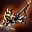 **Оскал Венеры** исправлен описание для PvP версии оружия с СА Ускорение
- Для эльфов мужчин исправлена проблема отображения 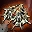 **Рука Икара** при экипированных 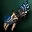 **Рукавицы Дестино**
- Исправлена ошибка отображения брони под плащом.
- Для Луков уменьшено потребление МР каждым выстрелом

| Ранг луков | До обновления | После обновления |
| --- | --- | --- |
| Без Ранга | 1-3 | 1 |
| Ранга D | 4-6 | 2 |
| Ранга C | 7-8 | 3 |
| Ранга B | 9 | 4 |
| Ранга A | 10 | 5 |
| Ранга S+ | 11-12 | 6 |

- Для следующих Рапир / Арбалетов изменено значение прибавки от СА Фокусировка

| Название | До обновления | После обновления |
| --- | --- | --- |
| 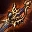 **Клещи Венеры** | 128 | 131 |
|  **Страж Венеры** | 128 | 133 |
|  **Драгоценная Рапира** | 137 | 134 |
| 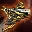 **Забойщик** | 137 | 139 |
|  **Рапира Вознесения** | 137 | 134 |
|  **Арбалет Шипов** | 137 | 139 |

- Теперь Сундук с Сокровищами Героя можно уничтожить (не касается русской версии игры)
- Из Сундука с Сокровищами Героя можно получить комплект Династии (не касается русской версии игры)
- Исправлены иконки предметов 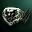 **Диадема Воина Шутгарта** и  **Диадема Воина Орена**
- Исправлено отсутствие в списке товаров некоторых арбалетных болтов.
- Исправлена проблема, из-за которой иногда беспорядочно смешивались вещи в инвентаре.
