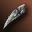
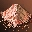
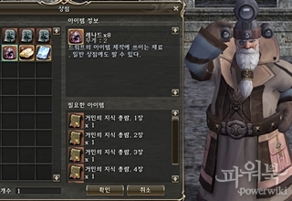

# Квесты
## Новые квесты

| Название | Уровень | Описание | Стартовый НПЦ |
| --- | --- | --- | --- |
| Плащ с вышитой душой -1(Закен) | 78 | Одноразовый квест на получение плаща. | Руна    Ольф Адамс |
| Плащ с вышитой душой -2(Фрея) | 82 | Одноразовый квест на получение плаща. | Руна    Ольф Адамс |
| Плащ с вышитой душой -3(Принтесс) | 80 | Одноразовый квест на получение плаща. | Руна    Ольф Адамс |

## Изменения в существующих квестах

- Упрощены квесты на получение статуса Дворянина
- Драгоценная душа, ч. 1:
    -  **Коготь Суккуба Малрука** ,  **Красный Мох** - вероятность получения этих квестовых предметов увеличена.
    -  **Красный Мох** - изменен способ получения квестового предмета:
        - До обновления: Стакато Одиночка Трутень (Болото Криков)
        - После обновления: Главный Приспешник Орков Тайк (Кладбище)
    - Шаг где требовалось общаться с Главным Кузнецом Ноэлем в Кузнице Годдарда удален из квеста.
- Драгоценная душа, ч. 3:
    -  **Кольцо Богини** ,  **Ожерелье Богини** - шанс получения этих квестовых предметов увеличен вдвое.
    -  **Посох Богини** - изменен способ получения квестового предмета:
        - До обновления: Необходимо было убить Рейдового Босса Баракиэль
        - После обновления: Можно выбрать способ получения квестового предмета
            - 1 способ: Убить Рейдового Босса Баракиэль
            - 2 способ: Охотится на монстров: Ревущий Флинд, Клыкастый Флинд, Коронованный Флинд, Флинд Печати пока не соберете 100 осколков Посоха Богини

## Прочие изменения в квестах

- Изменен диалог получения наград на выбор в следующих повторяемых квестах: Мечта торговца льдом (53), Горящие факелы (74), Охота на динозавров (75), Расцвет и упадок племени Элроки (75), Сопротивление Злу (75), Исследование Пещеры Гигантов, ч. 1 (79), Исследование Пещеры Гигантов, ч. 2 (79), Сражение со злыми духами (80), Опасность - шанс! (80), Призраки Батура (80), Эксплуатация полей (82), По уважительной причине (82)
- Конца и края нет исправлена проблема с исчезновение квестового НПЦ до окончания задания.
