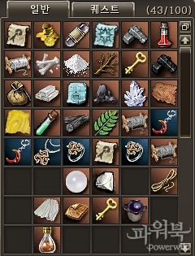
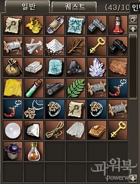
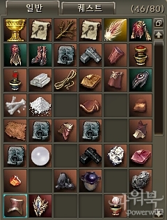
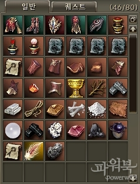

# Прочие изменения
## Изменения интерфейса

- Изменен диалог выбора точки воскрешения:
    - До обновления: По-порядку
    - После обновления: По восстановлению потерянного опыта
- Изменен порядок вкладок для общения с друзьями, теперь кнопка MSN мессенджера будет после кнопки "Чат с друзьями"
- Добавлена опция отключения отображения объявлений НПЦ в чате.
- Добавлена опция отображающая в приглашении в группу названия комнаты Поиска Группы (если приглашение посылается персонажу из списка ожидающих).
- Улучшено запоминание расположения предметов в инвентаре.
- Улучшена сортировка предметов в инвентаре:
    - До обновления предметы просто перемещались заполняя свободные ячейки в случайном порядке
    - После обновления определен строгий порядок сортировки предметов
        - Первыми в инвентаре выстраиваются целые предметы (броня, оружие) в порядке убывания веса предметов
        - Дальше в порядке убивания располагаются: Зелья и Эликсиры, Стрелы и Болты, Свитки и Рецепты, части предметов (ключевые материалы), ресурсы и прочие предметы.

|  | До сортировки | После сортировки |
| --- | --- | --- |
| До обновления |  |  |
| HF3 |  |  |

