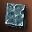
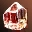
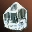
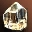
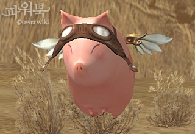

# Зоны Охоты и монстры

Изменены Легендарные Рейдовые Боссы:

- **Антарас**
    - Вход к Антарасу по прежнему осуществляется через **Сердце Заключенного**, но  **Камень Портала** не исчезает после входа.
    - Уменьшена скорость восстановления HP **Антараса**.
    - Уменьшено количество миньонов **Чудовищный Дракон** и **Дракон Тараска**.
    - Уменьшены характеристики миньонов **Дракон Тараска**.
    - Уменьшена сила умений Антараса.
    - Увеличено время применения умений Антараса.
    - Уменьшены характеристики Антараса
- **Валакас**
    - Вход к Валакасу по прежнему осуществляется через НПЦ Страж Валакаса Клен, но  **Парящий Камень Вакуалита** не исчезает после входа.
    - Уменьшена скорость восстановления HP **Валакаса**.
    - Миньонов **Старейший Лавазавр** теперь можно убить.
    - Уменьшено количество появляющихся миньонов
    - Характеристики и сила умений миньонов были уменьшены.
    - Уменьшена сила умений Валакаса.
    - Увеличено время применения умений Валакаса.
    - Уменьшены характеристики Валакаса.
- **Белеф**
    - Сила умений Белефа была уменьшена
    - Радиус атак Белефа был уменьшен.
- **Фрея (улучшенная)**
    - Уменьшена частота использования умения *Вечная Снежная Буря*
    - Время до повторного появление миньонов **Рыцарь Ледяного Лабиринта** увеличено.
    - HP Клакиеса уменьшено
    - HP миньонов **Рыцарь Ледяного Лабиринта** уменьшено
    - HP Фреи уменьшено.
- Добавлены предметы, которые можно использовать только во время рейдов на Антараса и Валакаса

| Название | Эффект | Время до повтора | Время действия | Цель |
| --- | --- | --- | --- | --- |
| Тотем Здоровья | Повышает скорость восстановления HP на 30% | 10 мин. | 30 мин. | Вокруг персонажа. |
| Тотем Духа | Повышает скорость восстановления МP на 15% | 10 мин. | 30 мин. | Вокруг персонажа. |
| Тотем Защиты | Повышает Физ. Защ. на 15% | 10 мин. | 30 мин. | Вокруг персонажа. |
| Тотем Магической Защиты | Повышает Маг. Защ. на 15% | 10 мин. | 30 мин. | Вокруг персонажа. |
| Очищенная Кровь Красного Дракона | Восстанавливает HP | 5 мин. | - | Все члены группы. |
| Очищенная Кровь Синего Дракона | Восстанавливает МР | 5 мин. | - | Все члены группы. |

- Добавлено новое событие при убийстве на сервере драконов Антараса или Валакаса:

- Появляется Глашатай Невитта
    - Можно телепортироваться в следующие места: Глудин, Глудио, Дион, Хейн, Деревня Охотников, Орен, Гиран, аден, Шутгарт, Годдард и Руна
    - Можете получить особый положительный эффект "Победа над драконом" - продлевает действие Благословения Невитта на 3 ч.
    - Глашатай Невитта пропадет через 3 часа.

## Хрустальный Лабиринт

- Для входа в Хрустальный Лабиринт и убийства Байлора, больше не нужны  **Красный Кристалл** ,  **Синий Кристалл** и  **Чистый Кристалл** .

## Сундуки с сокровищами

Следующие изменения внесены в систему Сундуков с Сокровищами

- Количество сундуков с сокровищами в полях было уменьшено.
- Сундуки можно открыть только с помощью умения  **Открыть** и нового предмета Ключ Мастера
    - Уже существующие в игре ключи от сундуков не будут действовать
- Ключ Мастера можно будет купить в любом городе или призвать с помощью умения  **Призвать Ключ Сокровищ**.
- Шанс получить награду сильно уменьшается в следующих случаях:
    - Персонажи 77- не смогут получить награду, если разница с уровнем сундука 6 уровней и больше.
    - Персонажи 78+ уровня не смогут получить награду, если разница с уровнем сундука 5 уровней и больше.
- При открытии сундука сохраняется шанс неудачи, после этого сундук будет взрываться
- В сундуке с небольшим шансом может оказаться Мешок Сокровищ Путешественника, из него можно получить:
    - Содержимое зависит от уровня персонажа и сундука, и может содержать оружие, доспехи и другие ценные предметы.

|  | Предмет | Описание |
| --- | --- | --- |
|  |  **Мешок Сокровищ Великого Путешественника**    (Great Adventurer's Treasure Sack) | Содержит в себе сокровища для великого путешественника. При использовании можно заполучить оружие категории Династии~Венеры. |
|  |  **Мешок Сокровищ Начинающего Путешественника**    (Beginner Adventurer's Treasure Sack) | Содержит в себе сокровища для начинающего путешественника. При использовании можно заполучить оружие категории D~C. |
|  |  **Мешок Сокровищ Опытного Путешественника**    (Experienced Adventurer's Treasure Sack) | Содержит в себе сокровища для опытного путешественника. При использовании можно заполучить оружие категории B~S(кроме Династии). |

## Камалока

- Внесены следующие изменения в Камалоку
    - В Зале Бездны, Лабиринте Бездны, после окончания сражения с монстром будет появляться колонна, для выхода из подземелья.

## Кузница Богов

Кузнец-путешественник Руни будет дольше задерживаться на местах своих стоянок.

## Скарабей

Скарабей заменен на Лакфи-Лакфи:

- Лакфи-Лакфи:
    - Лакфи-Лакфи выглядит как летающая свинка.
    - Лакфи-Лакфи громко возвещает о своем появлении, чтобы все могли посоревноваться за ее кормление, и привязывается к конкретному персонажу.
    - Лакфи-Лакфи ест адену неподалеку от себя, если в течение 10 минут не покормить свинку аденой она исчезнет.
    - Лакфи-Лакфи можно кормить минимум 3 раза, максимум 10 раз.
    - Если хорошо накормить Лакфи-Лакфи можно получить награду.
- Лакфи-Лакфи появляется в следующих зонах:
    - Лакфи-Лакфи 52 уровня: Волшебная Долина.
    - Лакфи-Лакфи 70 уровня: Лес Неупокоенных, Долина Святых.
    - Лакфи-Лакфи 80 уровня: Ферма Диких Зверей, Долина Ящеров, Школа Полномочий, Поля Безмолвия, Шепчущие Поля, Склепы Позора, Логово Зла, Первобытный Остров, Долина Драконов.
- Лакфи-Лакфи может дать следующие награды:
    - Лакфи-Лакфи 52 уровня: Сфера Сэрома: Ранг B, Камень Жизни Высшего Ранга - Уровень 52.
    - Лакфи-Лакфи 70 уровня: Сфера Сэрома: Ранг А, красный, зеленый или синий Кристалл Души 11 уровня.
    - Лакфи-Лакфи 80 уровня: Сфера Сэрома: Ранг S, Кристаллы Огня, Воды, Земли, Ветра, Святости и Тьмы.
