# Предметы
## Легендарные Аксессуары

- Изменены Серьга Антараса и Ожерелье Валакаса

| Предмет | Маг. Защ. |  | Бонус MP |  |
| --- | --- | --- | --- | --- |
| | До | После | До | После |
| 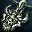 **Серьга Антараса** | 71 | 94 | 31 | 37 |
| 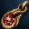 **Ожерелье Валакаса** | 95 | 125 | 42 | 50 |

## Экипировка Династии

- Изменение ранга предметов Династии
    - Ранг всех предметов династии изменен с S80 на S, и их можно экипировать с 76 уровня
    - Характеристики предметов не изменятся.

## Легендарное Оружие

- Уникальное оружие
    - Теперь можно получить уникальное оружие трофеем с некоторых монстров
    - Название уникального оружия будет написано фиолетовым цветом.
    - Характеристики совпадают с характеристиками оружия того же ранга.
    - Уникальное оружие можно передать, выбросить на землю, продать в личной лавке, продать НПЦ, кристаллизовать.
    - Уникальное оружие можно улучшить, можно придать особое свойство, усилить атрибутом, и PvP бонусом.
    - Нельзя конвертировать в оружие Камаэль, или обменять на оружие такого же ранга.
    - Уникальное оружие можно получить только в качестве трофеев, создание невозможно
    - Получить уникальное оружие можно со следующих монстров:

| Название | Тип оружия | Ранг | Монстр | Зона |
| --- | --- | --- | --- | --- |
| 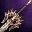 **Цветной Вольг** | Одноручный меч | S84 | Дарион | Мастерская Тулли |
| 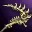 **Тиатенон** | Одноручная дубинка | S84 | Закен (83 ур.) | Логово Короля Пиратов |
| 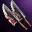 **Кухонный Нож Хабу** | Парные кинжалы | S80 | Тиада | Семя Разрушения |
| 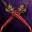 **Астарта** | Парные мечи | S | Аэнкинель (82) | Грань Реальности (Площадь) |
| 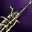 **Тирбинг** | Двуручный меч | S | Йохан Кланикус | Зал Страданий |
|  **Ветер Мардилла** | Магический меч | А | Бессмертный Спаситель Мадрил | Башня Дерзости |

- Каждое уникальное оружие имеет особое умение:

| Название | Умение | Действие |
| --- | --- | --- |
|  **Цветной Вольг** | Власть Цветного Вольга | При обычной атаке дает шанс вызвать сильное Кровотечение. |
|  **Тиатенон** | Власть Тиатенона | Во время PvP может заставить противника убежать от Вас. |
|  **Кухонный Нож Хабу** | Власть Кухонного Ножа Хабу | При обычной атаке дает шанс вызвать Кровотечение. |
|  **Астарта** | Власть Астарты | При обычной атаке может снизить Физ. Защ. противника. |
|  **Тирбинг** | Власть Тирбинга | При обычной атаке может снизить Физ. Защ. противника и Оглушить его. |
|  **Ветер Мардилла** | Власть Ветра Мардилла | При чтении заклинания есть 15% шанс усилить атаку атрибутом ветра (30) |

## Кристаллы Атрибута

- НПЦ Мастера стихий в Руне и Адене могут обменять камни стихий на кристаллы: 5 камней стихий +  3,000,000 аден = 1 кристалл

## Забытые Свитки

Некоторые Забытые Свитки теперь можно получить трофеями за убийство монстров.

-  **Забытый Свиток: Воля Мага**
    - Шепчущие Поля: - Хранитель Огня
    - Поля Безмолвия: - Спаситель Макрониан, Пророк Макрониан, Измененный Макрониан
-  **Забытый Свиток: Воля Стрелка**
    - Долина Ящеров: - Волшебник Ящеров Тантаар, Воин Ящеров Тантаар
-  **Забытый Свиток: Воля Воина**
    - Ферма Диких Зверей: - Горный Грендель (Золотой, этап 1), Горный Грендель (Золотой, этап 2), Горный Буйвол (Золотой, этап 1), Горный Буйвол (Золотой, этап 2)
    - Школа Полномочий: - Опытный Воин Ксель-Махум, Десятник Ксель-Махум, Главный Наставник Ксель-Махум
- 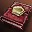 **Забытый Свиток: Защита Стихий**:
    - Долина Ящеров: - Воин Ящеров Тантаар
    - Школа Полномочий: - Рекрут Ксель-Махум
    - Шепчущие Поля: - Дух Атлета Огня, Грешник Макрониан
    - Поля Безмолвия: - Грешник Макрониан
    - Ферма Диких Зверей: - Горная Кукабарра (Золотая, этап 1), Горный Кугуар (Золотой, этап 1)
-  **Забытый Свиток: Защита Рун**:
    - Поля Безмолвия: - Фанатик Макрониан, Гельдрем Агрессор
    - Ферма Диких Зверей: - Горная Кукабарра (Золотая, этап 2), Горный Кугуар (Золотой, этап 2)
    - Школа Полномочий: - Наставник Ксель-Махум
-  **Забытый Свиток: Защита Равновесия**:
    - Поля Безмолвия: - Гельдрем Уничтожитель, Зараженный Макрониан
    - Школа Полномочий: - Рекрут Ксель-Махум
-  **Забытый Свиток: Владение Парными Кинжалами** - Спаситель Солины (Монастырь Безмолвия)
- 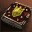 **Забытый Свиток: Отклонить Магию** - Проводник Солины (Монастырь Безмолвия)
-  **Забытый Свиток: Семь Стрел** - Искатель Солины (Монастырь Безмолвия)
- 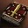 **Забытый Свиток: Спрятаться** - Пилигрим Солины (Монастырь Безмолвия)
-  **Забытый Свиток: Безмолвие Разума** - Ученик Солины, Божественный Надзиратель (Монастырь Безмолвия)
-  **Забытый Свиток: Барьер Слуги** - Божественный Стражник (Монастырь Безмолвия)
-  **Забытый Свиток: Броня Антимагии** - Божественный Стражник (Монастырь Безмолвия)
-  **Забытый Свиток: Шестое Чувство** - Божественный Боец (Монастырь Безмолвия)
-  **Забытый Свиток: Просветление Мага** - Божественный Защитник (Монастырь Безмолвия)
- 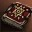 **Забытый Свиток: Просветление Лекаря** - Божественный Защитник (Монастырь Безмолвия)
-  **Забытый Свиток: Обращение в Камень** - Божественный Поклонник (Монастырь Безмолвия)
-  **Забытый Свиток: Фанатичная Преданность** - Божественный Поклонник (Монастырь Безмолвия)
- 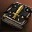 **Забытый Свиток: Найти Слабое Место** - Божественный Надзиратель (Монастырь Безмолвия)
-  **Забытый Свиток: Озарение** - Божественный Судья (Монастырь Безмолвия)
-  **Забытый Свиток: Обратная Связь** - Божественный Маг (Монастырь Безмолвия)

Забытые Свитки для изучения умений 83 уровня теперь можно передавать, а также их можно получить трофеями за убийство некоторых Рейдовых Боссов:

- Закен (83 ур.)
    - 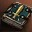 **Забытый Свиток: Броня Голема**
    -  **Забытый Свиток: Удар Низвержения**
    -  **Забытый Свиток: Дух Феникса**
    -  **Забытый Свиток: Семя Возмездия**
    -  **Забытый Свиток: Воля Евы**
    -  **Забытый Свиток: Оседлать Ветер**
    -  **Забытый Свиток: Потрясающее Приключение**
    - 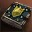 **Забытый Свиток: Крик Ада**
    -  **Забытый Свиток: Боль Шилен**
- Фрея (обычная)
    -  **Забытый Свиток: Электрический Шок**
    -  **Забытый Свиток: Повелитель Вампиров**
    -  **Забытый Свиток: Вампирический Туман**
    - 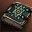 **Забытый Свиток: Благословение Евы**
    -  **Забытый Свиток: Великая Жертва**
    -  **Забытый Свиток: Печать Предела**
    -  **Забытый Свиток: Броня Урагана**
    -  **Забытый Свиток: Броня Мороза**
    -  **Забытый Свиток: Броня Пламени**
- Фрея (улучшенная)
    -  **Забытый Свиток: Походка Призрака**
    -  **Забытый Свиток: Призрачное Пробивание**
    -  **Забытый Свиток: Прилив Ужаса**
    -  **Забытый Свиток: Дождь Стрел**
    -  **Забытый Свиток: Дикий Выстрел**
    -  **Забытый Свиток: Сила Разрушения**
    -  **Забытый Свиток: Огненный Ястреб**

## Прочие изменения предметов

- Украшения
    - 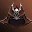 **Шапка Короля Пиратов** - теперь можно получить трофеем с дневного Закена
    - 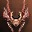 **Шапка Халиши** - теперь можно получить трофеем с Фринтезы
    - 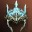 **Тиара Снежной Королевы** - теперь можно получить трофеем за убийство Фреи (обычной и улучшенной)
- За выполнение квестов в зонах Поля Безмолвия, Шепчущие Поля можно получить рецепты оружия Икара и доспехов Дестино.
-  **Конфета Белого Дня** - исправлена проблема повторного использования
- Предметное умение Возвращение, теперь правильно описывается в окне описания оружия.
- Для редких рапир / арбалетов Венеры, Забойщика - PvP, Рапира Вознесения - PvP исправлено описание СА Фокусировка:
- Для следующих предметов установлен единый откат использования: Сладкая Лепешка, Медовый Пирог, Конфета Белого Дня, Рисовый Хлебец, Рисовый Хлебец - Ивент, Новогодний Торт, Новогодний Торт - Ивент, Хеллоуинский Пирог - Ивент, Напиток Всплеска Энергии, Напиток Всплеска Энергии - Ивент
- Изменен внешний вид настоек и некоторые иконки:
    - Изменен внешний вид выпадающих настоек: Сильнодействующая Настойка Жизни, Великая Настойка Жизни, Сильнодействующая Настойка Маны, Великая Настойка Маны, Настойка Силы Крит. Атк. - Сила, Настойка Жизни - Поглощение Силы, Настойка Ускорения, Настойка Скор. Атк., Настойка Восстановления Энергии
    - Изменены иконки умений настоек: Настойка Скор. Атк., Настойка Ускорения, Настойка Силы Крит. Атк. - Сила, Настойка Жизни - Поглощение Силы
- Изменены иконки некоторых предметов:
    - Иконки свитков трансформации
    - Иконки предметов - Мешок Древних Ценностей и ему подобных предметов
    - Изменены иконки дублирующие иконки Самоцветов различных рангов: Бусина Серьги Эльфов, Бусина Ожерелья Эльфов, Бусина Мастера, Бусина Черного Ожерелья, Бусина Запечатанного Ожерелья Феникса, Бусина Запечатанного Ожерелья Величия
- 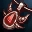 **Ожерелье Фринтезы** исправлена проблема с действием на откат Песен / Танцев.
- Исправлено описание оружия Камаэль S84
