# Chronicles

| C1 | C2 | C3 |
|:--:|:--:|:--:|
| [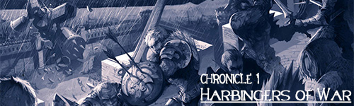](./C1_-_Harbingers_of_War/01_New_Territories.md) | [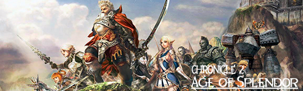](./C2_-_Age_of_Splendor/01_New_Territories.md) | [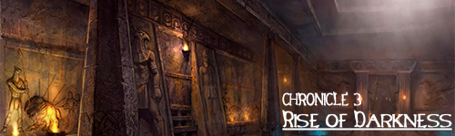](./C3_-_Rise_of_Darkness/01_Before_You_Begin.md) |

| C4 | C5 | IT |
|:--:|:--:|:--:|
| [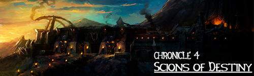](./C4_-_Scions_of_Destiny/01_Noblesse.md) | [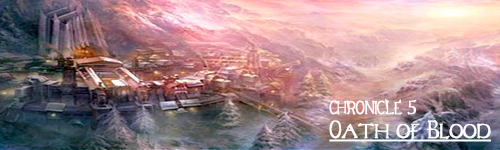](./C5_-_Oath_of_Blood/01_Character_Changes.md) | [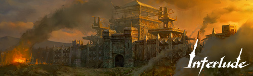](./C6_-_Interlude/01_Character_Changes.md) |

| CT1 | HB | GP1 |
|:--:|:--:|:--:|
| [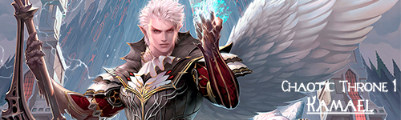](./CT1.0_-_Kamael/01_New_Race.md) | [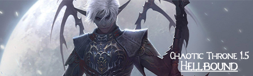](./CT1.5_-_Hellbound/01_Character_Changes.md) | [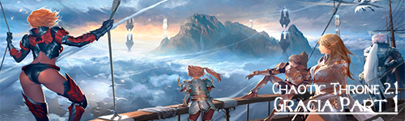](./CT2.1_-_Gracia_Part_1/01_Vitality_System.md) |

| GP2 | GF | GE |
|:--:|:--:|:--:|
| [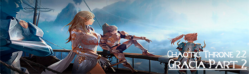](./CT2.2_-_Gracia_Part_2/01_Hunting_Grounds.md) | [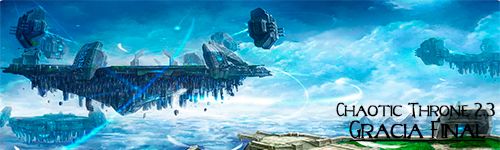](./CT2.3_-_Gracia_Final/01_Territory_War.md) | [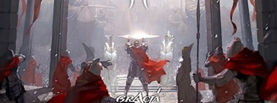](./CT2.4_-_Gracia_Epilogue(Plus)/01_Mail.md) |

