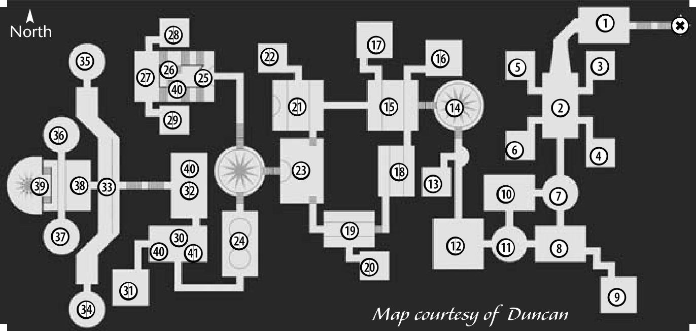

# 56 ELVEN FORTRESS (DUNGEON)

The Elven Fortress is a simple yet elegant dungeon, providing many side rooms and awesome soloing/party spots, as well as one of the best quests in Aden. The price to pay for this is an overpopulated area, but luckily, with all the side rooms and pathways, you can usually find a nook or a cranny with 3+ monsters to call your own!

**Appropriate Levels:** 9-23  

**Nearest Town:** Elven Village  

**Good Locations.** The entire dungeon is set up so well that it’s hard to find the ‘best’ spot, but there are certainly some spots that are more popular then others. People tend to avoid rooms with aggressive Skeleton Archer types and, especially in the later levels, the side-rooms of Kirunak’s hall are perfect spots. You probably want to avoid Varool Fouclaw’s room, as it is often packed with high-level questers.

**What Monsters Help.** Baraq Orc types, Skeleton types (including Kirunak’s Guards), Mist Terrors, Shade Horrors, Wererat types  

**What Monsters Aggro.** Baraq Orc Fighter, Dread Soldier, Dungeon Skeleton, Mist Terror, Dark Terror, Sukar Wererat Leader, Dre Vanul Tracker, Dre Vanul Beholder, Dre Vanul Slayer, Malex Herald of Dagoniel  

**Bosses.** Malex Herald of Dagoniel, Varool Foulclaw, Kirunak  

**Things to Watch For**  
Archers. Dungeon Skeleton Archer  

**Karma Spots.** This dungeon is generally a bad place to lose your Karma, because of the high population of questers and levelers.

---
