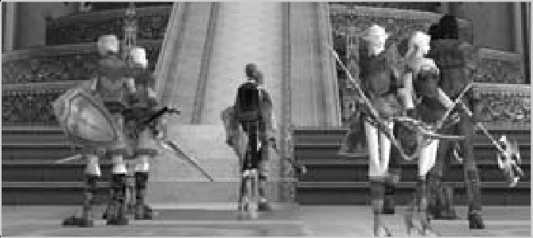

# 62 SWORDSMINGER
## SWORDSMINGER (← ELVEN KNIGHT ← ELVEN FIGHTER)

While your previous class was a good tank, the Swordsinger falls well below Temple Knight and such when it comes to 40+ tanking; you are a buffer now, and you should make allowances for that. If you can rely on your tank to keep the monsters off of you, you might even want to think about getting a magic robe for more MP. Even at Level 60 you will run out of MP before you can cast all of your songs.

- Song of Warding increases your party's M.Def by 30%. This is very useful when fighting monsters that use magical attacks. On the other hand, it has no effect at all when fighting melee-only monsters, so know your enemy.
  
- Song of Invocation increases your party's defense against undead by 20%. This is useful when fighting undead. When fighting monsters that aren't undead, it is useless.

- Song of Wind improves your party's speed by 15%. This is the first very useful song that Swordsingers get. A speed boost is never a bad thing, especially with the improved Chronicle 1 monster speeds; keep this spell on as much as you can!

- Song of Hunter doubles your party's crit. Chance. This is also a very useful song. It works best with dagger users, since doubling their already high crit. chance gives more bang for your MP.

- Song of Life improves your party's HP regen rate by 20%. While this is good for tanks and Warrior types, one might argue that it isn't really the most useful song at all, as 20% even on a good regen rate is only 3 or 4. Consider not casting this spell as often, to save MP.

- Song of Earth improves your party's P.Def by 15%. This is very useful in almost any situation, because in every party there is someone getting hit. Cast this spell often.

- Song of Water improves your party's Evasion by 10. While it isn't always useful because most upper-level parties are led by tanks, this spell is rather amazing. 10 Evasion is a lot, and if you cast this on a light armor user, prepare for them to evade a lot of hits.

- Sword Symphony — costing 120 MP, this spell is sort of a “last resort” when a party member pulls too many monsters at once. It does damage to the enemies, but more importantly it inflicts fear on them, causing them to run away.

{ width=350}

### HP / MP BY LEVEL

| LEVEL | HP  | MP  |
|-------|-----|-----|
| 41    | 1450| 492 |
| 42    | 1521| 517 |
| 43    | 1592| 543 |
| 44    | 1664| 569 |
| 45    | 1736| 595 |
| 46    | 1809| 621 |
| 47    | 1883| 648 |
| 48    | 1956| 675 |
| 49    | 2031| 702 |
| 50    | 2106| 729 |
| 51    | 2181| 756 |
| 52    | 2258| 783 |
| 53    | 2334| 811 |
| 54    | 2411| 839 |
| 55    | 2489| 867 |
| 56    | 2567| 895 |
| 57    | 2646| 924 |
| 58    | 2725| 952 |
| 59    | 2805| 981 |
| 60    | 2886| 1010|
| 61    | 2967| 1040|
| 62    | 3048| 1069|
| 63    | 3130| 1099|
| 64    | 3213| 1129|
| 65    | 3296| 1159|
| 66    | 3379| 1189|
| 67    | 3464| 1219|
| 68    | 3548| 1250|
| 69    | 3634| 1281|
| 70    | 3719| 1312|
| 71    | 3806| 1343|
| 72    | 3893| 1374|
| 73    | 3980| 1406|
| 74    | 4068| 1438|
| 75    | 4156| 1470|
| 76    | 4245| 1502|
| 77    | 4335| 1534|
| 78    | 4425| 1567|
| 79    | 4516| 1599|
| 80    | 4607| 1632|