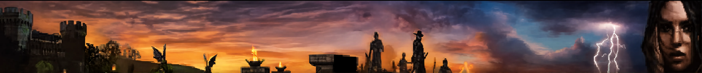

# 63 ELVEN SCOUT
## ELVEN SCOUT (← ELVEN FIGHTER)

Known for its speed and quick attacks, the Elven Scout is the best kiter in the game and the only dagger or bow user with a self-heal and a self-cure poison, which makes it much easier to solo in areas that are avoided for their poisonous qualities.

- Decide early on which weapon you want to focus on, and keep it maxed. Both dagger and bow are useful, but one can follow the other in due time.
- Mortal Blow is a high damage, high risk skill. It only works on a critical, so it is more likely to work if you use it flanking or behind the monster. Luckily for the Elven Scout, you get a Critical Chance skill which ups the chance of Mortal Blow hitting.
- Passive hunting is sometimes the way to go, as it gives you the chance for a first hit ... from behind!
- Power Shot is a wonderful opening move — and it doesn’t consume any arrows.
- Consider not getting a shield. Your class was made to evade, with light armor masteries and high DEX. Don’t spoil it with the -8 Evasion that a shield costs.
- Elven Scouts get a self-heal that is good for emergency situations, but when you are parted with a healer, let him do his job. Their heal does more and costs fewer MP — definitely more productive. If soloing, your heal can be good for minimizing downtime, but remember that you need your MP for Mortal Blows or shooting your bow, so don’t overdo it.
- When PvPing, know that you have a huge advantage over Humans and Dark Elves: speed. With your natural high speed, passive speed pluses, and self speed buff, you can kite your target to your heart’s content. Even if you’re a dagger user, if you find yourself in trouble, run.

- Don’t bother getting Unlock 2 or above. As of Chronicle 1, there are only Level 1 doors in the game, and Unlock 1 works well enough.

- Daggers have a higher critical chance, but have a higher chance to miss. Accuracy is a skill which you will either love or hate; it raises your chance to hit but sucks away MP. Still, it is fairly inexpensive to keep running, and you shouldn’t hesitate to turn it on going into PvP combat.

- Ultimate Evasion is best used when things have gone south, since it has such a long refresh time. It greatly enhances your Evasion, which means you won’t be hit for a considerable amount of time, but refresh on it is very harsh.

- Charm is the exact opposite of the tank spell Hate; where Hate draws monsters to a target, Charm gets them to leave you alone. If you find yourself the object of a monster’s affections, Charm it to make it switch to another party member. Watch out if it switches to a Mystic type; Mystics have no Charm spell of their own!

- Stun attacks in general are powerful things. Stun Shot doesn’t hit hard and uses a lot of MP, but the chance to make your opponent stand around dazed is worth the effort.

---

### HP / MP BY LEVEL

| Level | HP   | MP  |
|-------|------|-----|
| 21    | 503  | 200 |
| 22    | 542  | 216 |
| 23    | 582  | 226 |
| 24    | 622  | 239 |
| 25    | 663  | 252 |
| 26    | 703  | 266 |
| 27    | 745  | 279 |
| 28    | 786  | 293 |
| 29    | 828  | 307 |
| 30    | 870  | 321 |
| 31    | 913  | 335 |
| 32    | 956  | 349 |
| 33    | 995  | 363 |
| 34    | 1043 | 378 |
| 35    | 1087 | 392 |
| 36    | 1131 | 407 |
| 37    | 1176 | 421 |
| 38    | 1221 | 436 |
| 39    | 1266 | 451 |
| 40    | 1312 | 466 |