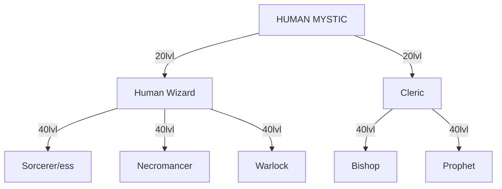
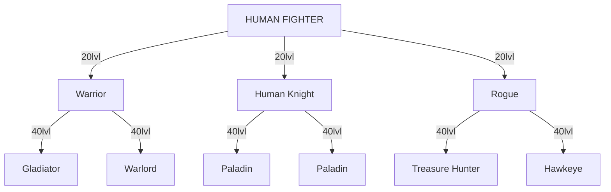

# 27 HUMAN
## HUMAN

The Humans of *Lineage II* are similar to the humans of our modern world. They possess no extreme abilities, but are very well balanced. In *Lineage II*, Humans have the most choice in their specialized class. Humans land in the middle of the pack when it comes to natural abilities with weapons or magic.

Human Fighters can initially choose to be Knights (heavy armor, swords/blunts and shield), Warriors (flexible armor choice, blunt and/or polearms) or Rogues (light armor, dagger and/or bow). While Knights and Rogues have counterparts in the Dark Elf/Elf societies (Palus Knight, Ranger, etc), the Warrior class line is only similar to the Orc Tyrant, and then only until 40. Human Knights get a unique skill that can make Elves and Dark Elves drool: Shield Stun. Compared to Stun Attack or Stun Shot, Shield Stun has the highest stun rate. The only downside is that it does no damage, while its counterparts do.

The biggest disadvantage for a Human Fighter is his lower MEN. However, the difference is minor, and the impact on MP regeneration (used when executing skills) and Magic Defense is not very noticeable. Human also have a slow movement speed.

Human Mystics can initially choose to be Wizards (attack magic, mostly fire, and summoned beasts, such as Kat or Mew the Cat) or Clerics (support magic, such as buffs and heals). While Elves and Dark Elves have healer classes like the Cleric, they only have one class choice at Level 40, a combined healer/buffer. The Cleric, on the other hand, gets to choose between Bishop (powerful heals) and Prophet (amazing buffs).

