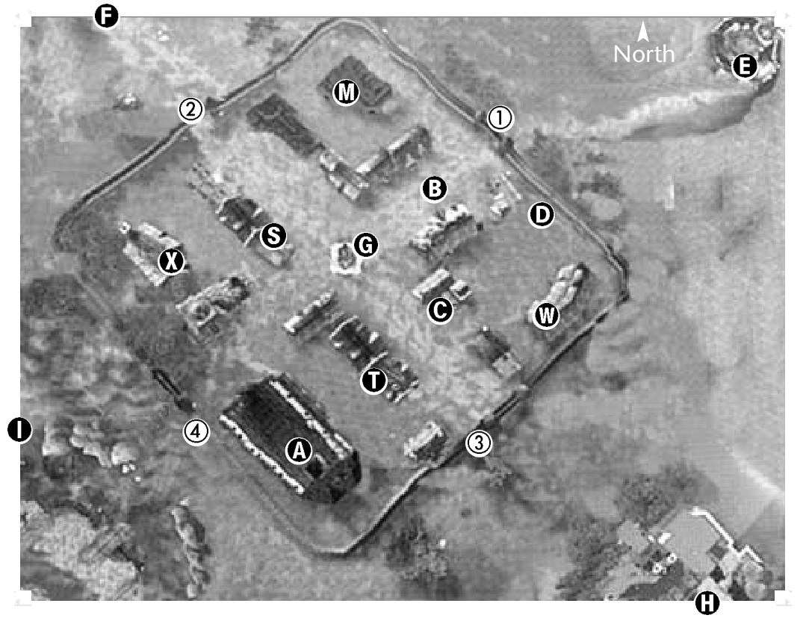

# 28 Talking Island Village
## Talking Island Village

---

### Key

 **A**: High Priest Biotin  
  - Priest Yohanaes ◆  
  - Magister Baulro ◆  
  - Magister Harrys ◆  
  - Priest Petron ◆  
  - Lilith  

 **B**: Master Gwinter ✺  
  - Master Pintage ✺  
  - Master Minia ✺  
  - Grand Master Bitz  

 **C**: Bonnie  

 **D**: Cristel  

 **E**: Lighthouse Keeper Rockswell  

 **F**: Sir Collin Windawood  
  - Obelisk of Victory  

 **G**: Elias, Darin,  
  - Guide Kensley  

---

 **H**: Cedric’s Training Hall  
  - Grand Master Roien  
  - Master Maslin  
  - Master Carlrin  
  - Master Guts  
  - Master Langut  

 **I**: Einhasant’s School of Magic  
  - Grand Magister Gallint  
  - Magister Riak  
  - Magsiter Rianon  
  - Magister Guprang  
  - Magister Daefian  

 **M**: Magic  
  - Trader Silvia (Jewelry)  
  - Trader Katerina (Books)  

 **S**: Smithy  
  - Blacksmith Altran  

 **T**: Gatekeeper Roxxy  

---

 **W**: Warehouse  
  - Warehouse Keeper Wilford  
  - Warehouse Keeper Rolfe  
  - Warehouse Keeper Rant  

 **X**: Weapons & Armor  
  - Trader Lector  
  - Trader Jackson  

---

 **①**: → *Lighthouse, NE shore*  
  - Guard Leon  
  - Captain Gilbert  

 **②**: → *Obelisk, Elven Ruins*  
  - Guard Kenyos  
  - Guard Hanks  

 **③**: → *Sir Cedric’s (HF start)*  
  - Guard Arnold  
  - Guard Abellos  

 **④**: → *Einiovant’s (HM start), Obelisk, Elven Ruins*  
  - Guard Johnstone  
  - Guard Chiperan  

---

✺ Fighter Trainer  ◆ Mystic Trainer