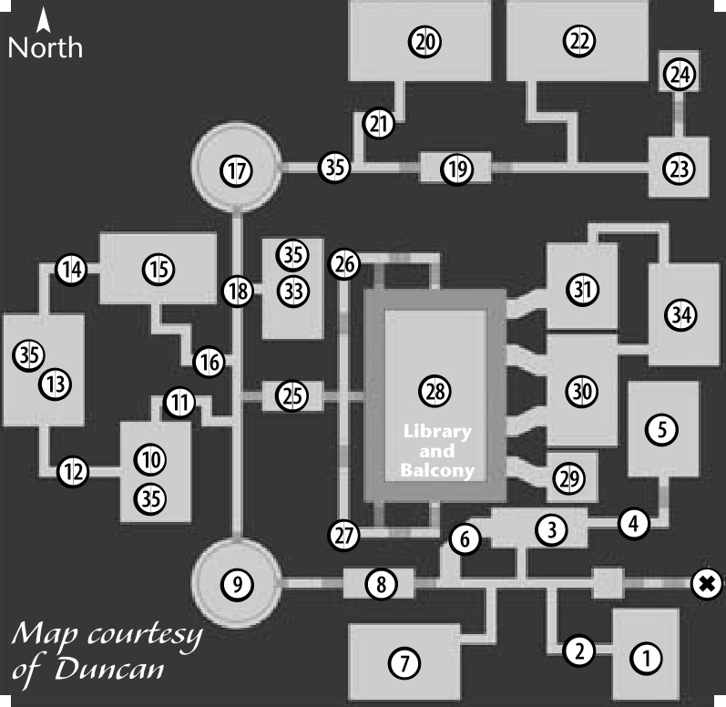

# 30 ELVEN RUINS (DUNGEON)
## ELVEN RUINS

 **1**:  
  - 2 Tunath Orc Marksman (10)  
  - 2 Relic Werewolf (9)  
  - 2 Vampire Bat (10)  

 **2**:  
  - 1 Skeleton (12)*  

 **3**:  
  - 2 Tunath Orc Marksman (10)  
  - 1 Vampire Bat (10)  

 **4**:  
  - 1 Skeleton (12)*  

 **5**:  
  - 3 Tunath Orc Warrior (12)*  
  - 2 Monster Eye (10)  
  - 2 Skeleton (12)*  

 **6**:  
  - 1 Skeleton (12)*  

 **7**:  
  - 2 Tunath Orc Marksman (10)  
  - 2 Tunath Orc Warrior (12)*  
  - 2 Relic Werewolf (9)  
  - 1 Vampire Bat (10)  

 **8**:  
  - 3 Skeleton (12)*  

 **9**:  
  - 2 Drill Bat (11)  
  - 2 Skelton (12)*  
  - 3 Stone Giant (13)  

 **10**:  
  - 2 Tunath Orc Marksman (10)  
  - 2 Tunath Orc Warrior (12)*  
  - 2 Monster Eye (10)  
  - 2 Skeleton (12)*  

 **11**:  
  - 1 Skeleton Marksman (14)  

 **12**:  
  - 1 Skeleton Marksman (14)  

 **13**:  
  - 3 Skeleton (12)*  
  - 2 Skeleton Marksman (14)  
  - 3 Stone Giant (13)  

 **14**:  
  - 1 Skeleton Marksman (14)  

 **15**:  
  - 2 Tunath Orc Marksman (10)  
  - 2 Tunath Orc Warrior (12)*  
  - 1 Monster Eye (10)  
  - 2 Skeleton (12)*  

 **16**:  
  - 1 Skeleton Marksman (14)  

 **17**:  
  - 2 Dungeon Spider (15)*  
  - 3 Skeleton (12)*  
  - 2 Skeleton Archer (13)*  

 **18**:  
  - 2 Drill Bat (11)  

 **19**:  
  - 2 Skeleton (12)*  

 **20**:  
  - 2 Dungeon Spider (15)*  
  - 2 Skeleton Marksman (14)  
  - 3 Stone Giant (13)  
  - 3 Misery Skeleton (14)*  

---

 **21**:  
  - 1 Skeleton Archer (13)*  

 **22**:  
  - 2 Dungeon Spider (15)*  
  - 2 Skeleton Lord (15)  
  - 3 Stone Giant (13)  
  - 3 Misery Skeleton (14)*  

 **23**:  
  - 1 Skeleton Archer (13)*  
  - 1 Skeleton Marksman (14)  
  - 2 Skeleton Lord (15)  

 **24**:  
  - 1 Dre Vanul (20)*  
  - 1 Dre Vanul Scout (21)*  

 **25**:  
  - 3 Tunath Orc Warrior (12)*  

 **26**:  
  - 2 Monster Eye (10)  

 **27**:  
  - 2 Monster Eye (10)  

 **28**:  
  - 3 Cave Blade Spider (17)*  
  - 4 Silent Horror (16)*  
  - 3 Skeleton Lord (15)  
  - 3 Misery Skeleton (14)*  
  - 4 Wererat (16)  

 **29**:  
  - 2 Stone Giant (13)  
  - 2 Wererat (16)  

 **30**:  
  - 2 Dre Vanul Scout (21)*  
  - 3 Relic Spartoi (21)  

 **31**:  
  - 2 Dre Vanul Scout (21)*  
  - 3 Silent Horror (16)*  

---

 **33**:  
  - 2 Drill Bat (11)  
  - 1 Tunath Orc Marksman (10)  
  - 1 Tunath Orc Warrior (12)*  
  - 2 Stone Giant (13)  

 **34**:  
  - 3 Salamander (17)  
  - 3 Undine (17)*  

 **35**: Every 5 hours or so, spawns at 1 of 4 locations:  
  - 1 Oblivion Watcher (17)  
  - 4 Discarded Guardian (20)*  

 **36**: Quest for dungeon boss:  
  - 1 Nerkas (22)  

---

Nahir (35) also appears for a quest.

**Asterisks indicate aggressive monsters.*