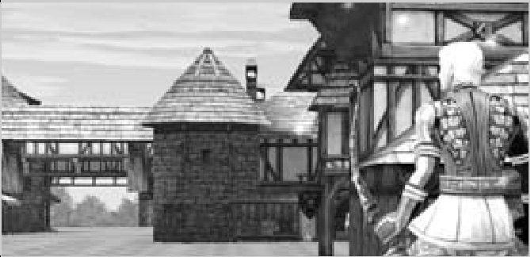

# 38 PALADIN
## PALADIN (< HUMAN KNIGHT < HUMAN FIGHTER)

Even though the Dark Avenger is thought to be more of a tank then the Paladin, especially in the lower levels, Paladin doesn’t rank far behind Avenger. Though you don’t have the panther, you still have Hate and UD, and of course the signature Paladin heals and undead fighting skills.

- While you might think of the Paladin as a tank healer, try using your MP to shield stun, not heal, except in extreme situations. By Level 40 you should be grouping most of the time, and healers use less MP and heal more HP in less time then you can!
- Majesty is an awesome skill! It improves your P.Def by 7-15% (depending on level) which, for a Knight, is well worth the 2-6 Evasion loss!
- As you can tell from the Paladin’s skill list, their forté is undead. Between the active Holy Strike and the passive Holy Blade/Armor, you are a skeleton and ghost killing machine. Seek out undead.
- Sacrifice is an amazing skill, especially if you aren’t a frontline tank. This skill heals the target for about 900 HP, using your HP instead of your MP. This is useful when your healer already has an aggro or two pounding at her, or when she’s fresh out of MP.
- Flashy and quick to cast, Sanctuary makes a good opening to a fight versus several undead, as it has an area-effect radius. This is especially good when facing an undead leader; pull it close, flash your Sanctuary spell, and throw Ultimate Defense into effect.
- A character with Shield Mastery 4, such as a Level 52+ Paladin, succeeds in shield defense 99% of the time when facing an archer.

---

- Invest in Magic Defense items; a lot of the undead and upper-level monsters use magic, and it’s good to be prepared for that! Another thing — the higher your Magic Defense, the more effect Iron Will has. The same with Physical Defense and Majesty.
{ align=right width=300 }
- Where Hate pulls one monster onto you, Hate Aura pulls all monsters around you to attack you. This is very good when a Cleric or a Rogue type finds himself being chased by leaders or a group spawn.

## HP / MP BY LEVEL

| LEVEL | HP   | MP   |
|-------|------|------|
| 41    | 1610 | 484  |
| 42    | 1684 | 509  |
| 43    | 1759 | 535  |
| 44    | 1835 | 560  |
| 45    | 1911 | 586  |
| 46    | 1988 | 612  |
| 47    | 2065 | 638  |
| 48    | 2143 | 664  |
| 49    | 2222 | 691  |
| 50    | 2301 | 717  |
| 51    | 2380 | 744  |
| 52    | 2461 | 771  |
| 53    | 2541 | 799  |
| 54    | 2623 | 826  |
| 55    | 2705 | 854  |
| 56    | 2787 | 882  |
| 57    | 2870 | 910  |
| 58    | 2954 | 938  |
| 59    | 3038 | 966  |
| 60    | 3123 | 995  |
| 61    | 3208 | 1024 |
| 62    | 3294 | 1053 |
| 63    | 3380 | 1082 |
| 64    | 3467 | 1111 |
| 65    | 3555 | 1141 |
| 66    | 3643 | 1171 |
| 67    | 3732 | 1200 |
| 68    | 3821 | 1231 |
| 69    | 3911 | 1261 |
| 70    | 4001 | 1291 |
| 71    | 4092 | 1322 |
| 72    | 4184 | 1353 |
| 73    | 4276 | 1384 |
| 74    | 4369 | 1416 |
| 75    | 4462 | 1447 |
| 76    | 4556 | 1479 |
| 77    | 4650 | 1511 |
| 78    | 4745 | 1543 |
| 79    | 4841 | 1575 |
| 80    | 4937 | 1607 |
