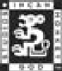

# CREDITS

*Writers*

**Editors & Panel Contributors**

*Editors*

**David Ladyman, Laura "Taera" Genender**

*Book Design*

**Raini Madden**

*Layout*

**David Ladyman, Tuesday Frase, Raini Madden**

*Game Art*

**NCSoft**

*Many Thanks!*

**Our Indispensable Support at NCsoft
Aaron Rigby, Katie Adams, JangHan Jung**

---

**Craig "Linspatz" Hanson**

**Adam "Duncan" Beberg, chief cartographer and head of the Lineage 2 Documentation Project (L2DP) http://www.mithral.com/~beberg/L2DP/**

---

**IMGS Panelists who braved hot vats of midnight oil to fulfill the call of duty:**

- Colin "TheDunkenFriar" Doody
- Ethan "Esis" Kidhardt
- Ernie "Zandarbar" Whited

---

**IMGS Panelists who went above and beyond the call of duty:**  

- Kristin "Katyara" Bates
- Scott "Godslayer" Burgess
- Jason "Executor" Choi
- Kenneth Fautt
- Kevin "Owyn" McLaughlin
- Amer "Amer" Mallah
- Gary "Kylock" Morrow
- Kai "TRC" Nirkkonen
- Tim "Dariuas" Slager
- Ian "Lohengrin" Taylor
- Trey "UltraPh0enix" Webb
- CP "Kittychan" Wilkinson

---

The Prima Games logo is a registered trademark of Random House, Inc., registered in the United States and other countries. Primagames.com is a registered trademark of Random House, Inc., registered in the United States.

© 2004 by Prima Games. All rights reserved. No part of this book may be reproduced or transmitted in any form or by any means, electronic or mechanical, including photocopying, recording, or by any information storage or retrieval system without written permission from Prima Games. Prima Games is a division of Random House, Inc.

Product Manager: Damien Waples

©2004 NCsoft Corporation. Lineage® II and NCsoft® are registered trademarks, and The Chaotic Chronicle is a trademark of NCsoft Corporation. All rights reserved. All other registered trademarks or trademarks are property of their respective owners.

All products and characters mentioned in this book are trademarks of their respective companies.

Please be advised that the ESRB rating icons, “EC”, “K-A”, “E”, “T”, “M”, “AO” and “RP” are copyrighted works and certification marks owned by the Entertainment Software Association and the Entertainment Software Rating Board and may only be used with their permission and authority. Under no circumstances may the rating icons be self-applied or used in connection with any product that has not been rated by the ESRB. For information regarding whether a product has been rated by the ESRB, please call the ESRB at 1-800-771-3772 or visit www.esrb.org. For information regarding licensing issues, please call the ESA at (212) 223-8936. Please note that ESRB ratings only apply to the content of the game itself and does NOT apply to the content of this book.

Important:

Prima Games has made every effort to determine that the information contained in this book is accurate. However, the publisher makes no warranty, either expressed or implied, as to the accuracy, effectiveness, or completeness of the material in this book; nor does the publisher assume liability for damages, either incidental or consequential, that may result from using the information in this book. The publisher cannot provide information regarding game play, hints and strategies, or problems with hardware or software. Questions should be directed to the support numbers provided by the game and device manufacturers in their documentation. Some game tricks require precise timing and may require repeated attempts before the desired result is achieved.

ISBN: 0-7615-4501-8

Library of Congress Catalog Card Number: 2003116127

Printed in the United States of America

04 05 06 07 AA 10 9 8 7 6 5 4 3 2 1

---

{ align=left width="40"}
Incan Monkey God Studios  
www.incanmonkey.com