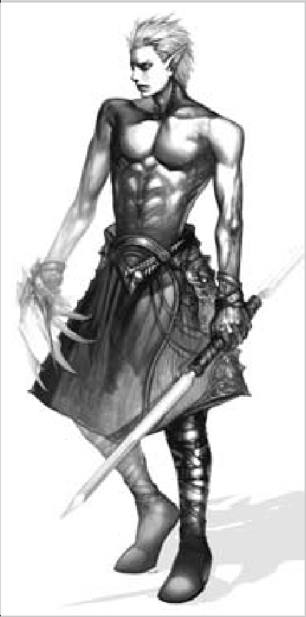

# 89 SPELLHOWLER
## SPELLHOWLER ( ← Dark Wizard ← Dark Mystic)

The Spellhowler is the most deadly of the Wizard-types and definitely the best bet for any young adventurers with future hopes of taking out Antharas. Its spells are centered on wind and, as proper for a Dark Elf, death.

- If you thought it was hard to solo as a Wizard, it gets even worse as the levels progress. Monsters become faster, meaner and tougher; you really need a tank friend from Level 40 onwards, and forget trying to solo after 50.
- Hurricane becomes your bread-and-butter attack. As it’s a wind spell, continue to go after floating targets if possible, but remember that you aren’t the only one in your party. A Paladin might want to go after undead or a Spellsinger after fire monsters, and so forth.
- Death Spike does a lot of damage as well, but note that it uses up an item (cursed bone), and thus burns adena. Try to stick to Hurricane if possible.
{width=230 align=right}
- When you find yourself low on HP, Death Link is the spell to use. Death Link takes the pain of the caster and transfers it to the target. The lower your HP when you cast, the more damage you do. Switch to this spell whenever you have a monster beating on you.
- Silence is a very useful skill, especially in PvP. When it’s cast successfully, the target is unable to cast any magic for 2 minutes.

- Tempest is your new AoE (area-of-effect) attack, but remember that as you party more and more often, it isn’t as useful as it used to be. Still, for the rare occasion of a slow 40+ monster … head ‘em up and move ‘em out!
- Important! As your prominent element is wind, you become very important in Antharas take-down tactics once you reach Level 50. Antharas is very strong and very resistant to both magical and physical attacks … but he has -50% defense against wind, meaning that you are one of the very few classes that can hit him for more than 100 damage in a single hit!

### HP / MP by Level

| LEVEL | HP   | MP   |
|-------|------|------|
| 41    | 1001 | 731  |
| 42    | 1044 | 769  |
| 43    | 1088 | 808  |
| 44    | 1133 | 846  |
| 45    | 1177 | 885  |
| 46    | 1222 | 924  |
| 47    | 1268 | 964  |
| 48    | 1313 | 1003 |
| 49    | 1359 | 1044 |
| 50    | 1406 | 1084 |
| 51    | 1452 | 1124 |
| 52    | 1499 | 1165 |
| 53    | 1547 | 1206 |
| 54    | 1594 | 1248 |
| 55    | 1642 | 1290 |
| 56    | 1690 | 1332 |
| 57    | 1739 | 1374 |
| 58    | 1788 | 1417 |
| 59    | 1837 | 1460 |
| 60    | 1887 | 1503 |
| 61    | 1937 | 1546 |
| 62    | 1987 | 1590 |
| 63    | 2038 | 1634 |
| 64    | 2089 | 1679 |
| 65    | 2140 | 1723 |
| 66    | 2192 | 1768 |
| 67    | 2244 | 1813 |
| 68    | 2296 | 1859 |
| 69    | 2349 | 1905 |
| 70    | 2402 | 1951 |
| 71    | 2455 | 1997 |
| 72    | 2509 | 2044 |
| 73    | 2563 | 2091 |
| 74    | 2617 | 2138 |
| 75    | 2672 | 2186 |
| 76    | 2727 | 2234 |
| 77    | 2782 | 2282 |
| 78    | 2838 | 2330 |
| 79    | 2894 | 2379 |
| 80    | 2950 | 2428 |