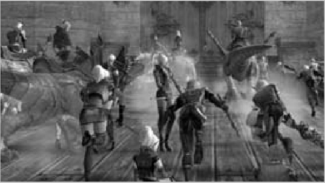

# 90 PHANTOM SUMMONER
## PHANTOM SUMMONER (← DARK WIZARD ← DARK MYSTIC)

Phantom Summoners are focused on … summoning. For someone who has taken the long trip through Dark Wizard, they are a blessing from Shilen. From here on out you don’t have those horrible six-hour wait times between summons and new buffs make your pet more powerful then ever. You are a caster that brings their own tank to the party!

- From here on out you have a choice of changing to light armor. Stay in robes (because the added MP far outweighs the added MP regen time), but get a level of Light Armor Mastery in case you ever find yourself with a light armor set.
- Shadows and silhouettes are solid tanks, and you are their healer and buffer. They have lots of hit points to hit hard. Don’t be afraid to send them into the fray constantly. Coupled with Servitor Heal (which you don’t have to target them to use), you can even safely send them to tie up additional opponents while you and your group tackle the main target, and expect them to live.
- Debuff and poison your opponent and send in your pet. Save your mana for timely Servitor Heals after you have set the opponent up for your pet.
- You don’t really get that many attack skills from here on out, so when you feel that your Twister just isn’t more then a brush on the shoulder, think about making the switch from Mystic weapon to Fighter weapon. Your primary focus will likely be playing healer and buffer for your pet, and most healers and buffers out there already use a good Fighter weapon, as M.Atk has no effect on heals or buffs.
- Be aware that, as your attack skills get more and more outdated, it might become harder for you to find a good group. While you’re an effective healer/tank team that takes half the mana, you can’t heal the other party members, can’t resurrect, and can’t heal in battle if the going gets tough. Be prepared to duo with your pet very often.
{width=300 align=right}
- More and more servitor buffs become available as you progress through the levels. As always, make sure to keep your helper fully buffed; give yourself a shot of Might 1 or Shield 1 right before you buff your buddy so that you know its buffs are about to wear out when yours starts wearing out!
- For more pet tips, see **Necromancer** (p. 47) and **Warlock** (p. 49).

### HP / MP BY LEVEL

| LEVEL | HP   | MP   |
|-------|------|------|
| 41    | 1004 | 731  |
| 42    | 1051 | 769  |
| 43    | 1098 | 808  |
| 44    | 1145 | 846  |
| 45    | 1193 | 885  |
| 46    | 1241 | 924  |
| 47    | 1290 | 964  |
| 48    | 1339 | 1003 |
| 49    | 1388 | 1044 |
| 50    | 1438 | 1084 |
| 51    | 1488 | 1124 |
| 52    | 1538 | 1165 |
| 53    | 1589 | 1206 |
| 54    | 1640 | 1248 |
| 55    | 1691 | 1290 |
| 56    | 1743 | 1332 |
| 57    | 1795 | 1374 |
| 58    | 1847 | 1417 |
| 59    | 1900 | 1460 |
| 60    | 1953 | 1503 |
| 61   | 2007  | 1546 |
| 62   | 2061  | 1590 |
| 63   | 2115  | 1634 |
| 64   | 2170  | 1679 |
| 65   | 2225  | 1723 |
| 66   | 2280  | 1768 |
| 67   | 2336  | 1813 |
| 68   | 2392  | 1859 |
| 69   | 2448  | 1905 |
| 70   | 2505  | 1951 |
| 71   | 2562  | 1997 |
| 72   | 2620  | 2044 |
| 73   | 2677  | 2091 |
| 74   | 2736  | 2138 |
| 75   | 2794  | 2186 |
| 76   | 2853  | 2234 |
| 77   | 2912  | 2282 |
| 78   | 2972  | 2330 |
| 79   | 3032  | 2379 |
| 80   | 3092  | 2428 |
