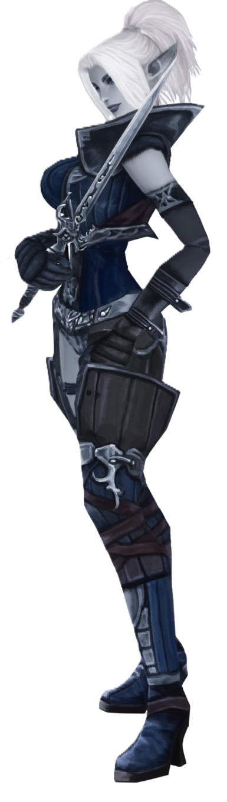
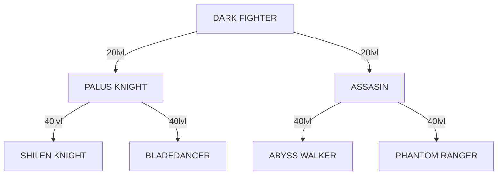
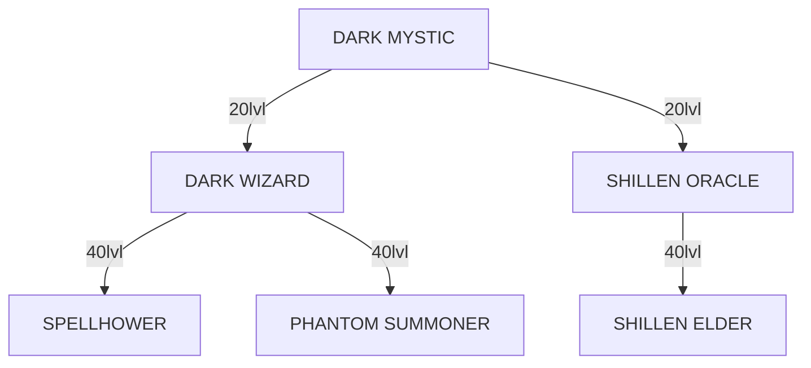

# 73 INTRODUCTION
## DARK ELF
{width=250 align=right}
Dark Elves were once Elves, but turned dark when they learned black magic to battle the Humans. They worship the goddess of Death, Shillien. Dark Elves have the most attack power of all races (highest STR of Fighters, highest INT of Mystics), however, they have the least ability to withstand attacks (lowest CON).

Dark Elf Fighters can choose to be Palus Knights (heavy armor, swords/blunts) or Assassins (light armor, dagger and/or bow). Dark Elf Fighters have the highest STR and INT of all Fighters, which means that the damage inflicted by their physical and magical attacks is highest among Fighters. Their reduced CON means they have the lowest HP and HP regeneration among Fighters. Their unique skills, Drain Energy and Sting, come very useful in the heat of battle. Drain Energy is a HP-stealer; it takes HP from a target and gives it to the caster. Sting is a low-power attack, but it has a chance of making the target bleed.

Dark Elf Mystics can initially choose to be Dark Wizards (attack magic, mostly wind, and summoned beasts, such as Shade and Silhouette) or Shillien Oracles (support magic, such as buffs and heals).

