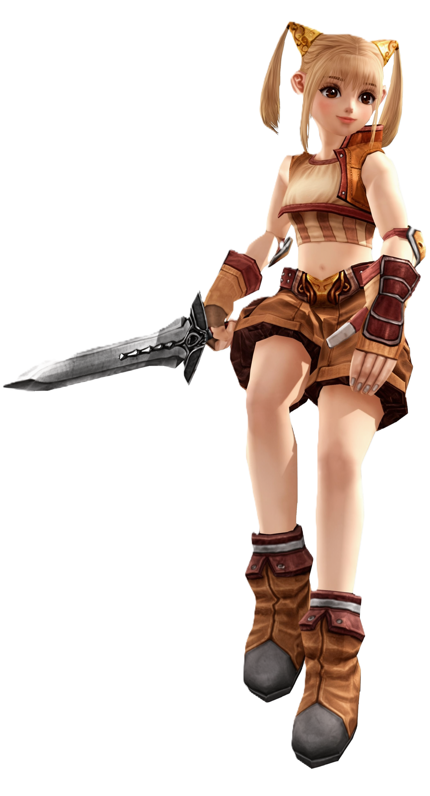
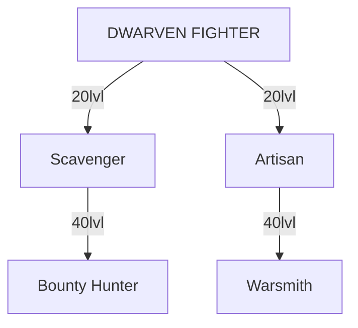

# 109 INTRODUCTION
## DWARF
{width=380 align=right}
Dwarves always attempted to side with the most powerful race as they are entrepreneurial in nature and renowned for business savvy and organization skills. All Dwarves are Fighters and do not use magic. Like Orcs, they have high CON and high MEN, which gives them lasting power.

Dwarf Fighters can choose to be Artisans (crafting of items from materials and parts) or Scavenger (locating of items from materials and parts). Both classes get identical fighting skills (flexible armor, blunts and/or polearm).

While initially all the items a resident of Aden needs can be purchased in stores, many of the most powerful items in the game can only be constructed through a combination of efforts between Scavenger and Artisans. This makes Dwarves a critical part of the *Lineage II* economy.

