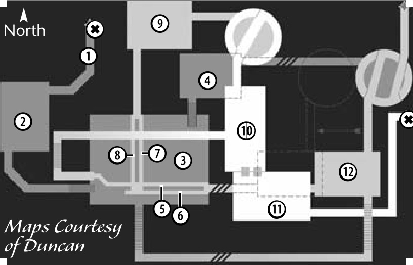

# 112 ABANDONED COAL MINES (DUNG.)
## ABANDONED COAL MINES (DWARVEN DUNGEON)

### KEY (Abandoned Coal Mines)

{width=440 align=right}

**1**   
- 2 Utuku Orc (6)   
- 1 Utuku Orc Grunt (7)  

**2**   
- 6 Black Timber Wolf (6)   
- 6 Goblin Brigand (8)   
- 6 Utuku Orc Grunt (7)   

**3**   
- 9 Garum Werewolf (9)   
- 10 Utuku Orc (6)   
- 9 Utuku Orc Archer (8)   
- 10 Utuku Orc Grunt (7)   

**4**   
- 6 Garum Werewolf (9)    
- 6 Goblin Brigand (8)   
- 5 Goblin Brigand Lt. (10)*   

**5**   
- 4 Blade Bat (10)   

**6**    
- 4 Blade Bat (10)   

**7**   
- 3 Goblin Brigand Lt. (10)*   

**8**   
- 3 Goblin Brigand Lt. (10)*   

**9**   
- 9 Gemstone Beast (12)   
- 10 Magical Weaver (11)   

**10**   
- 9 Barbed Bat (12)   
- 9 Gemstone Beast (12)   
- 9 Magical Weaver (11)   

**11**   
- 7 Barbed Bat (12)   
- 7 Gemstone Beast (12)   
- 6 Goblin Lord (13)   

**12**   
- 4 Blade Bat (10)   
- 5 Garum Werewolf (9)   
- 4 Magical Weaver (11)   

---

**Appropriate Levels: 6-16 What Monsters Help:** Goblin types (but not Goblin Lords), Utuku Orc types, Blade Bats, Garum Werewolves, Barbed Bats, Magical Weavers  
**What Monsters Aggro:** Goblin Brigand Lieutenant
**Archers.** Utuku Orc Archers 
**Casters.** Magical Weavers (Mana drain, damage)

* Asterisks indicate aggressive monsters.

---

### KEY (Mithril Mines)

**1**   
- 2 Akaste Bone Soldier (12)*   
- 1 Mineshaft Bat (11)   
- 1 Monster Eye Tracker (10)   

**2**   
- 3 Akaste Bone Soldier (12)*   
- 4 Mineshaft Bat (11)   
- 4 Monster Eye Tracker (10)   

**3**   
- 2 Darkstone Golem (13)   
- 2 Mineshaft Bat (11)   

**4**   
- 3 Darkstone Golem (13)   
- 3 Mineshaft Bat (11)   

**5**   
- 4 Akaste Bone Soldier (12)*   
- 4 Darkstone Golem (13)   

**6**   
- 5 Akaste Bone Archer (14)   
- 5 Akaste Bone Soldier (12)*   

**7**   
- 5 Akaste Bone Archer (14)   
- 4 Akaste Bone Soldier (12)*   
- 5 Darkstone Golem (13)   

**8**   
- 3 Akaste Bone Soldier (12)*   
- 3 Will-O-Wisp (15)   

**9**   
- 2 Akaste Bone Archer (14)   
- 2 Akaste Bone Soldier (12)*   
- 2 Will-O-Wisp (15)   

**10**   
- 3 Darkstone Golem (13)   
- 4 Will-O-Wisp (15)   

**11**   
- 2 Boogle Ratman (16)   
- 2 Opal Beast (15)*   
- 2 Ore Bat (17)*   

**12**   
- 7 Opal Beast (15)*   

**14**
- 5 Boogle Ratman (16)   
- 5 Corpse Candle (15)   
- 4 Will-O-Wisp (15)   

**15**   
- 2 Boogle Ratman (16)   
- 3 Corpse Candle (17)   

**16**   
- 5 Corpse Candle (17)   
- 6 Opal Beast (15)*   
- 5 Pitchstone Golem (19)   

**17**   
- 5 Akaste Bone Warlord (17)*   

**19**   
- 5 Boogle Ratman Leader (18)   

**20**   
- 5 Ore Bat (17)*   

**21**   
- 5 Ore Bat (17)*   

**24**   
- 6 Akaste Bone Warlord (17)*   

**25**   
- 5 Akaste Bone Warlord (17)*   

**26**   
- 3 Akaste Bone Lord (19)*   
- 3 Akaste Bone Warlord (17)*   
- 3 Pitchstone Golem (19)   