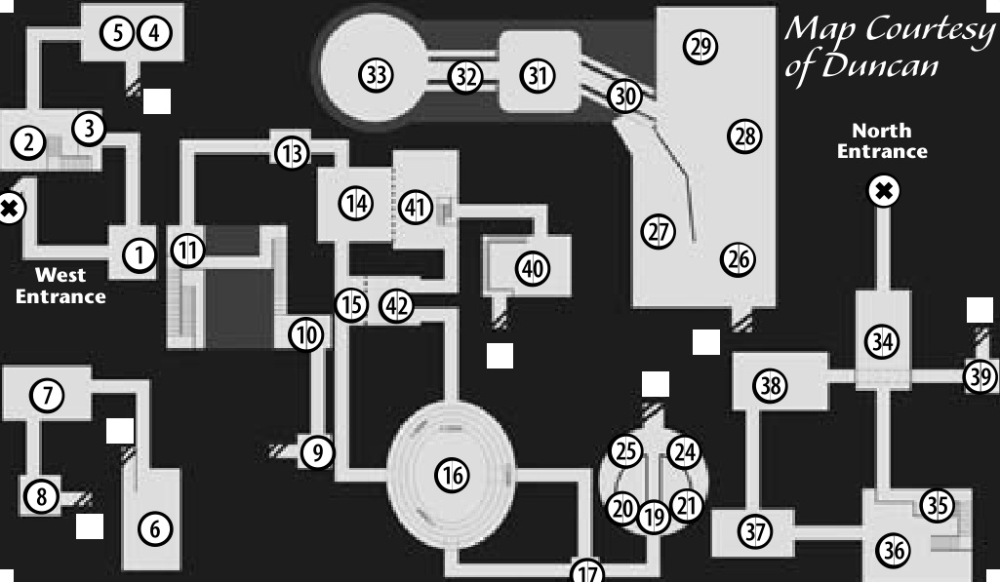

# 113 MITHRIL MINES (DUNGEON)
## MITHRIL MINES (DWARVEN DUNGEON)

|Room connections| |
|--|--|
|1 |2 |
|3 |4 |

---

**Appropriate Levels.** 12-22   

**What Monsters Help.**   
Akaste Skeleton types, Boogle Ratman types, Corpse Candles, Mineshaft Bats, Darkstone Golems, Monster Eye Trackers, Pitchstone Golems, Succubus types

**What Monsters Aggro.**   
Akaste Bone Soldier and Lord, Opal Beast, Ore Bat, Nightmare Weaver

**Things to Watch For**   
*Archers.* Akaster Bone Archers   
*Casters.* Corpse Candle and Will-O-Wisp: Splash   
Akaste Succubus (both): Sleep   
Pitchstone and Darkstone Golem: damage   
Monster Eye Tracker: Hold   

**27**   
- 3 Boogle Ratman Leader (18)   
- 4 Pitchstone Golem (19)   

**28**   
- 4 Akaste Bone Lord (19)*   
- 3 Boogle Ratman Leader (18)   
- 4 Pitchstone Golem (19)   

**29**   
- 5 Akaste Bone Lord (19)*   
- 5 Nightmare Weaver (21)*   
- 4 Pitchstone Golem (19)   

**30**   
- 5 Akaste Succub. Turen (21)*   

**31**   
- 3 Akaste Bone Lord (19)*   
- 4 Akaste Succub. Turen (21)*   
- 4 Nightmare Weaver (21)*   

**32**   
- 4 Akaste Succubus Tilfo (22)*   

**33**   
- 13 Akaste Succubus Tilfo (22)*   
- 13 Akaste Succub. Turen (21)*   

**34**   
- 4 Akaste Bone Soldier (12)*   
- 4 Mineshaft Bat (11)   
- 5 Monster Eye Tracker (10)   

**35**   
- 4 Darkstone Golem (13)   

**36**   
- 4 Akaste Bone Archer (14)   
- 4 Akaste Bone Soldier (12)*   
- 4 Darkstone Golem (13)   
- 4 Opal Beast (15)*   

**37**   
- 5 Akaste Bone Soldier (12)*   
- 5 Darkstone Golem (13)   
- 4 Mineshaft Bat (11)   
- 1 Ore Bat (17)*   

**38**   
- 5 Akaste Bone Archer (14)   
- 5 Akaste Bone Soldier (12)*   
- 6 Mineshaft Bat (11)   

**39**
- 2 Opal Beast (15)*   
- 3 Will-O-Wisp (15)   

**40**   
- 4 Boogle Ratman (16)   
- 3 Ore Bat (17)*   
- 4 Will-O-Wisp (15)   

**41**   
- 6 Boogle Ratman (16)   
- 7 Corpse Candle (17)   

**41**   
- 4 Corpse Candle (17)   
- 4 Opal Beast (15)*   
