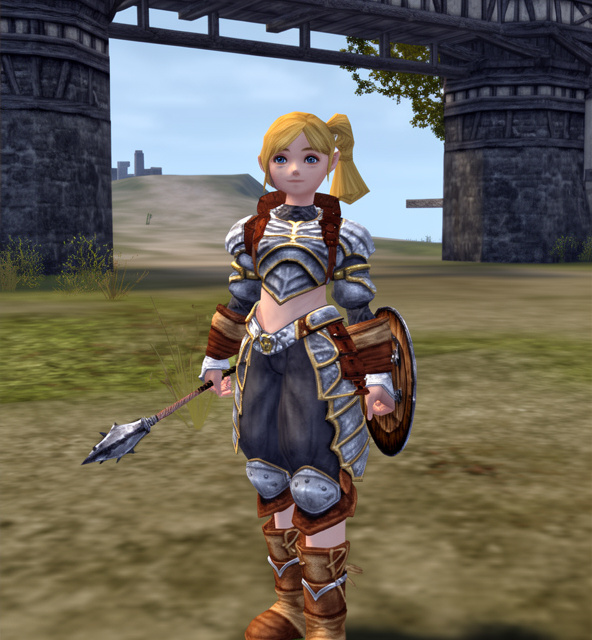

# 116 SCAVENGER
## SCAVENGER (← DWARVEN FIGHTER)

Scavengers are part of the two-part crafting system in *Lineage II* — Scavengers/Bounty Hunters gather materials, and Artisans/Warsmiths make the items. Both classes rely heavily on each other.

- Since gathering materials is your main role, what you hunt will often be dictated by what materials you are trying to gather.
- While you do not craft any items, there are five materials you can combine: braided hemp (for all stems), course bone powder (for all animal bones), leather (for all animal skins), cokes, and steel. Make sure you keep those five recipes.
- Unless you’re a clan leader, you should almost earn enough SP to learn all your skills as soon as they become available. Learn Spoil, Blunt Mastery, Stun Attack and then other passive skills. Unlike other classes, all Scavenger skills do exactly what they say they do in the skill list, so they don’t need further description here.
- Skip Light Armor Mastery, because you should always be in heavy armor.
- Scavengers have the advantage of high HP and fast regeneration, but since you give up all the Fighter skills to be able to Spoil, and tend to use all your MP to Spoil, you aren’t a prime solo candidate. Stick to easy monsters if you get stuck soloing. That can be frustrating, since you’ll want to hunt hard monsters for the spoils.
- By this point, you should be through with anything but one-handed blunt weapons — you get Stun and Blunt Mastery, and your shield will block many arrows. (Well, a good polearm is handy when you’re wading into a crowd of mobs, especially lower-level critters, once you have Wild Sweep.)
- In a group, you will mainly spoil when you have the MP, and do a little damage. You can tank quite well, but remember that you have no Hate skill to keep aggro on you, so your Mystics and healers must be careful! While Stun is very useful, especially with your high Dwarf CON, it takes up MP that could otherwise be used on spoiling.

- As part of a clan, spoil, spoil and more spoil. Did I mention spoil? You will gather materials for the Artisans in your clan to turn into C-grade items that you and your friends will need soon.
- For crafting tips, see **Collecting & Crafting**, p. 119.

{width=380 align=right}

### HP / MP BY LEVEL

| LEVEL | HP     | MP  |
|-------|--------|-----|
| 21    | 617    | 201 |
| 22    | 675    | 214 |
| 23    | 735    | 227 |
| 24    | 791    | 241 |
| 25    | 850    | 254 |
| 26    | 910    | 268 |
| 27    | 970    | 281 |
| 28    | 1031   | 295 |
| 29    | 1092   | 309 |
| 30    | 1154   | 323 |
| 31    | 1216   | 337 |
| 32    | 1279   | 352 |
| 33    | 1349   | 366 |
| 34    | 1406   | 380 |
| 35    | 1470   | 395 |
| 36    | 1535   | 410 |
| 37    | 1600   | 425 |
| 38    | 1666   | 440 |
| 39    | 1732   | 455 |
| 40    | 1799   | 470 |