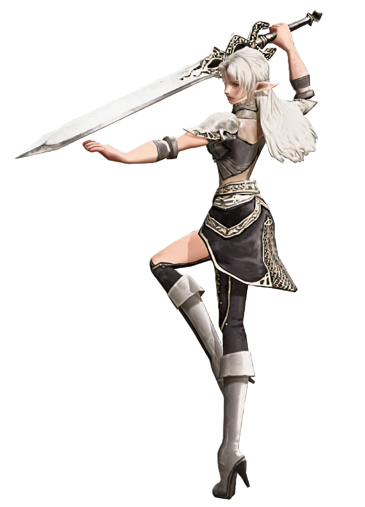
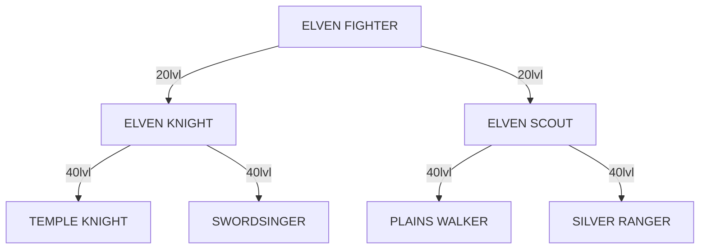
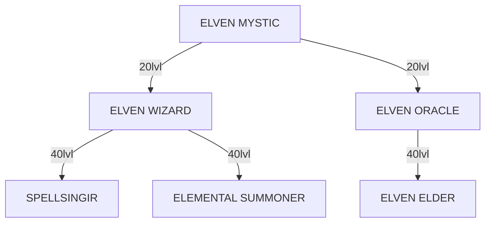

# 53 INTRODUCTION
## ELF
{width=350 align=right}
The Elves of *Lineage II* worship the goddess of water and are in tune with nature. Elven Fighters and Mystics are tuned to be fast and accurate with a high DEX (for Fighters) and WIT (for Mystics), but pay for this with a low STR (Fighters) and INT (Mystics).

Elven Fighters can choose to be Elven Knights (heavy armor, swords/blunts) or Elven Scouts (light armor, dagger and/or bow). Elven Fighters have high speed, accuracy, evasion, frequent critical hits, but less damage per hit. All Elven Fighters get two very unique skills: Charm and Elemental Heal. Charm works like an opposite-hate, that is, it convinces monsters not to hit you. Elemental Heal is a high-cost heal, though it beats having nothing.

Elven Mystics can initially choose to be Elven Wizards (attack magic, mostly water, and summoned beasts. Such as Boxer and Mirage the Unicorn) or Oracles (support magic, such as buffs and heals). Elven Mystics have fast spell-casting, but less damage per cast.

