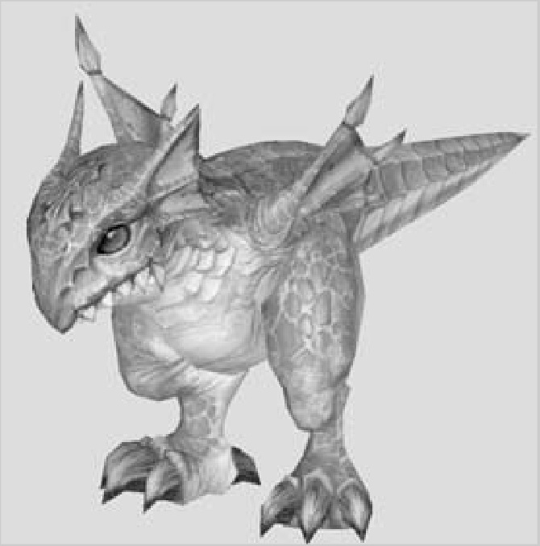

# 95 ORC VILLAGE
## ORC VILLAGE

Perched high atop the bluffs of the Immortal Plateau, the home village of the Orcs resembled a fortified military installation instead of a friendly city. Its west walls lead to the Temple of Paagrio (where you start), and the other edges of the village overlook the rugged mountains of Elmore. The first thing you'll notice about this area is that the Orcs' strength is offset by the difficulty in getting from one place to another. No nice little trek across a plateau — leave that for the weakling Humans in Talking Island Village! Here, the easiest way to get from point A (town) to point B (mobs) is to jump off the cliffs. Literally. (One caveat — right now, there's no fall damage, but we can't promise that won't change in the future.)

**Appropriate Levels** For skills, you can't train anything new for a few levels, so complete the three early quests and repeat the money quests for a while. Stay in Orc land until you're ready to do your profession quest. Before that, there's plenty to keep you busy. If you get bored in town, head for the Cave of Trials (but don't forget that Escape Scroll for the trip home).

**Good Locations** The north-south road just east of the village is the most obvious place to hunt Imps and Goblins. You can get away from the crowd a little if you jump off the south cliff and head right. There, you'll find a collection of Keltirs, Wolves, Imps and Goblins suitable for getting you through Level 5 or so.

The plateau area about halfway between the village and the falls is a good place to hunt Werewolves. Toward the back of the valley, you can find Marakus behind the trees. If it's crowded, you'll have to camp for spawns.

**Landmarks** Frozen Waterfalls (northeast), Cave of Trials (east)

**What Monsters Help** Rakeclaw Imp types, Goblin Grave Robbers, Mountain Fungi, Maraku Werewolf types

**What Monsters Aggro** Kasha Bear, Grizzly, Rakeclaw Imp Chieftain
{width=350 align=right}
**Centurion Nakusin** Centurion Nakusin is a bit of a grump. When you do the Lord of Flame quest, write down the items that asks you to get: Varkees (honey khendar), Tataru Zu Hestui (bear fur cloak), Uska (ancestor's skull), Grookin (axe), Gantaki Zu Urutu (orb), Kunai (spider dust).

**Things to Watch For** Be careful of the area in front of the Frozen Waterfalls unless you're in the mid-to-late teens. Lots of aggro creatures hang out in the frozen plateau area and will train on you!

- *Magic Users*: Greystone Golems
- *Archers*: None that we've seen so far
- *Other*: Did we mention Scrolls of Escape?