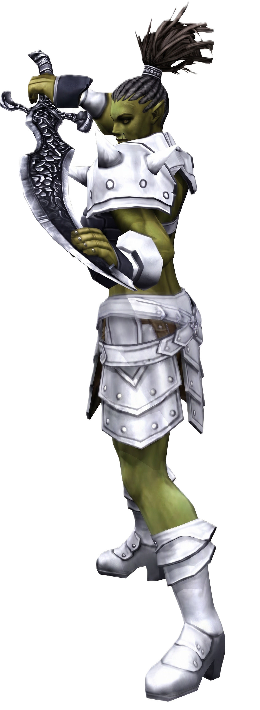

# 100 ORC RAIDER
## ORC RAIDER (← ORC FIGHTER)
{width=380 align=right}
The Orcish equivalent of a Human Warrior, the Orc Raider is a powerful attacker and hard to kill, due to its stockpile of ‘emergency skills.’ The downside is a much slower run speed, making it even more kitable then Humans.

- You can learn and use both blunt and polearm skills. Pick one style, and concentrate your skill points and adena on keeping it the best that it can be. The other style can come later.
- If you pick blunts, consider grouping for your primary experience. If you pick polearms, you might be better off hunting solo for packs of green mobs.
- A polearm is a valuable weapon — instead of hitting a single target, it hits several targets at once. Thus one of the best tactics to use with a polearm is to herd or pull two or three monsters together and take them all out at once. Make sure you can handle getting hit by all these monsters at once, though!
- If you’re go with blunts, you’re probably better off with heavy armor and Heavy Armor Mastery. If you prefer a polearm, light armor and its mastery are probably better. Why? Polearm users usually do masses of blue-green monsters, while blunts tend to be used against green-yellow monsters. While heavy armor is good for defense against hard hitters, you can usually evade most things green or lower if you’re in light armor.
- Fast HP Recovery is very important. It causes your HP regeneration speed to increase by a significant amount. This, coupled with Vital Force, makes a huge improvement when sitting or using Relax.
- Rage subtracts 3 Evasion and 20% of your P.Def. On the other hand, it adds 45% to your P.Atk.

- Battle Roar - This skill is, in my opinion, the best skill of the 20-40 Warrior skills. This skill lasts about 12 minutes and has a 10-minute recharge time. While the skill is activated, the user is given 10% more hit points (e.g., if you have 1000 hitpoints maximum, you have 1100 hitpoints for the duration of this spell.)

- While Frenzy can only be used when you have less than 20% of your HP left, it gives you an amazing advantage. Think of this as the “I’m almost dead, let’s get me saved” skill, because that’s what it does. It casts quickly, and it doubles your P.Atk, so you have a good chance of killing whatever is hurting you before it kills you.

- Guts is lot like Frenzy, again only usable when you have less than 20% of your HP left. This time though, it doubles your P.Def, once again buying you time to stay alive.

### HP / MP BY LEVEL

| Level | HP  | MP  |
|-------|-----|-----|
| 21    | 636 | 201 |
| 22    | 695 | 214 |
| 23    | 755 | 217 |
| 24    | 816 | 241 |
| 25    | 877 | 254 |
| 26    | 938 | 268 |
| 27    | 1000| 281 |
| 28    | 1063| 295 |
| 29    | 1126| 309 |
| 30    | 1189| 323 |
| 31    | 1253 | 337 |
| 32    | 1318 | 352 |
| 33    | 1383 | 360 |
| 34    | 1449 | 380 |
| 35    | 1515 | 395 |
| 36    | 1582 | 410 |
| 37    | 1649 | 425 |
| 38    | 1717 | 440 |
| 39    | 1786 | 455 |
| 40    | 1855 | 470 |